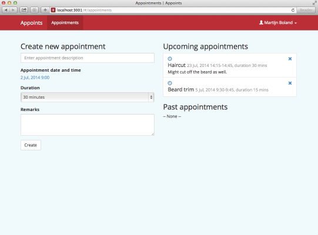

A little while ago [I blogged about Appoints-Api](../appoints-api-a-simple-example-appointment-scheduler-rest-api/). This is an example appointment scheduling REST API built on [Node.js](http://nodejs.org). To complement this API, there now is an example HTML/JavaScript client, based on [AngularJS](http://angularjs.org) and the [angular-hal](https://github.com/LuvDaSun/angular-hal) library.

The source code of Appoints-Client is at [GitHub](https://github.com/martijnboland/appoints-client) and a live demo can be found [here](https://appoints-client.azurewebsites.net). Feel free to create alternative implementations or native apps. Just let me know and I’ll add it to the list of clients.

For Microsoft people: did you notice that both the REST API and client are hosted on Azure? That’s right, all non-Microsoft technology but still working perfectly fine on Azure!
