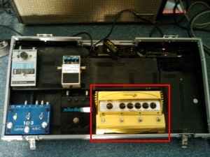
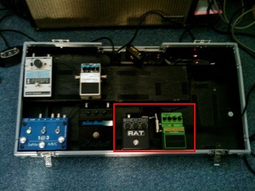
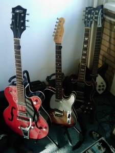

_Warning: this post doesn’t only contain the usual software dev stuff, but also some serious guitar-geekiness._

This morning, I was shocked when I found out how much the development of my [pedalboard](http://en.wikipedia.org/wiki/Guitar_pedalboard) went through exactly the same stages as the way I’m building ASP.NET web applications. First let’s see where I’m coming from:

In the picture above you can see a large yellow device. This is the [Line 6 Distortion Modeler](http://bx.line6.com/dm4/). It claims that it can produce all the classic distorted guitar tones that you’ll ever want and to a certain extend this is true. The sound is alright and the possibilities are huge. But also: the output (sound wise) that this device produces is always less than the original pedals that it’s trying to emulate. Also, the switches are a little bit unreliable and cause a little gap when changing sounds. I tried to fix this, but the device is very inaccessible and doesn’t lend itself very well for modifications or extensions.

### Less is better

These days I’m back to where I came from: two simple pedals that don’t have a gazillion options but just do their work and are very efficient:

On the left we have the [Proco RAT](http://www.procosound.com/?page=viewprod&cat=150&id=741) and on the right it’s the [Digitech Bad Monkey](http://www.digitech.com/products/Pedals/BadMonkey.php) (‘told you we’d have some guitar-geek talk in this post, remember?). These guys are simple, reliable and their output is just the way I want my distortion to sound without losing dynamics and tone. Full control!

_So, what does this have to do with ASP.NET web development?_

Nothing of course :) It just struck me that at about the same time I switched from ASP.NET Webforms to MVC, I also changed my pedalboard to accomplish the same result: making the end result better with a more simplistic approach. The yellow monster in the first picture is like Webforms with ASP.NET AJAX where I have a love-hate relationship with. The two pedals in de second picture feel like the MVC and jQuery combination (loosely coupled, only connected with a little patch cable), that brought a lot of fun lately and work very well for me.

_Yeah, great analogy, NOT! I didn’t subscribe to read this blah about some guitar thingy._

Well it just something that went through my mind this morning and writing about it also gives me a chance to post some crappy gear pictures, like it or not. Here’s another one for free:

;-)

P.S. the empty spot above the pedals is normally reserved for my [Electro Harmonix Memory Man Deluxe](http://www.ehx.com/products/deluxe-memory-man) but this drama queen is broken at the moment and deserves a single post of its own.
