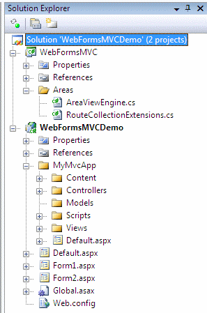

_This post briefly describes a solution to mix ASP.NET WebForms and MVC in one project. You can download a sample project that might be more useful than my ramblings. Download the sample here, unzip, open with VS 2008 SP1 and hit F5._

There are lots of ‘legacy’ ASP.NET WebForms applications out there in the wild. What if you want to create new functionality or rebuild an existing part with ASP.NET MVC, but you can’t (or won’t) create a separate new project?

The simple solution is to add the default MVC folders (Content, Controlllers, Scripts, Views etc.) to the root of the web project, add references to the MVC binaries, modify web.config and add the MVC GUID to the ProjectTypeGuids in the project file. A major drawback however is that it pollutes the root of your carefully structured application. This post will show you how you can logically separate the new MVC pieces from the existing WebForms app in a single project.

### Isolate the MVC bits

  A simple requirement: I want that all my MVC folders reside in the folder /MyMvcApp _and_ I also want that all urls of the MVC app start with /mymvcapp. No interference with my old WebForms app please.

### Area’s

About a year ago, [Phil Haacked showed a concept called area’s](http://haacked.com/archive/2008/11/04/areas-in-aspnetmvc.aspx) to partition an ASP.NET MVC application. After that, [Steve Sanderson came up with an improved version](http://blog.codeville.net/2008/11/05/app-areas-in-aspnet-mvc-take-2/) of the concept.

Although designed to partition an MVC application, area’s are also useful when we want to isolate our MVC application from our existing WebForms app. [The solution from Steve Sanderson](http://blog.codeville.net/2008/11/05/app-areas-in-aspnet-mvc-take-2/) almost completely fits our needs, follow the link for more technical details. The only thing I removed was the usage of an Areas subfolder in the project where all the individual MVC sub-applications. Simply didn’t need the extra subfolder and url of the MVC app is closer to the physical structure.

So, I implemented area’s with a specific AreaViewEngine that can lookup views based on the area name and added the extension to the RouteCollection class to add area information when mapping routes. This is how Global.asax.cs looks:

```
protected void Application_Start(object sender, EventArgs e)
```

```
{
```

```
    ViewEngines.Engines.Clear();
```

```
    ViewEngines.Engines.Add(new AreaViewEngine());
```

```
    // Routes
```

```
    RegisterRoutes(RouteTable.Routes);
```

```
}
```

```
public static void RegisterRoutes(RouteCollection routes)
```

```
{
```

```
    routes.IgnoreRoute("{resource}.axd/{*pathInfo}");
```

```
    routes.IgnoreRoute("{*favicon}", new { favicon = @"(.*/)?favicon.ico(/.*)?" });
```

```
    routes.CreateArea("mymvcapp", "WebFormsMVCDemo.MyMvcApp.Controllers",
```

```
        routes.MapRoute("mymvcapp-defaultroute", "mymvcapp/{controller}/{action}/{id}", new { action = "Index", controller = "Home", id = "" })
```

```
    );
```

```
}
```

With the ViewEngine and routes in place, we’re able to run the MVC app from the url /mymvcapp. To make sure the WebForms url’s still work, we just have to add some ignore statements in Global.asax.cs (in our case, exclude .aspx and .ashx from routing):

```
public static void RegisterRoutes(RouteCollection routes)
```

```
{
```

```
    routes.IgnoreRoute("{resource}.axd/{*pathInfo}");
```

```
    routes.IgnoreRoute("{*allaspx}", new { allaspx = @".*\.aspx(/.*)?" });
```

```
    routes.IgnoreRoute("{*allashx}", new { allashx = @".*\.ashx(/.*)?" });
```

```
    routes.IgnoreRoute("{*favicon}", new { favicon = @"(.*/)?favicon.ico(/.*)?" });
```

```
    routes.CreateArea("mymvcapp", "WebFormsMVCDemo.MyMvcApp.Controllers",
```

```
        routes.MapRoute("mymvcapp-defaultroute", "mymvcapp/{controller}/{action}/{id}", new { action = "Index", controller = "Home", id = "" })
```

```
    );
```

```
}
```

One caveat: when performing the request for /mymvcapp without controller name (and action), the Default.aspx that comes with the MVC projects was loaded, but area’s seem so cause a problem with the default one. Instead of rewriting the url from ‘default.aspx’ to ‘/’, I had to rewrite to url to ‘Home/Index’:

```
public partial class _Default : Page
```

```
{
```

```
    public void Page_Load(object sender, System.EventArgs e)
```

```
    {
```

```
        string pathToRewriteTo = Request.Path.ToLowerInvariant().Replace("default.aspx", "Home/Index");
```

```
        HttpContext.Current.RewritePath(pathToRewriteTo, false);
```

```
        IHttpHandler httpHandler = new MvcHttpHandler();
```

```
        httpHandler.ProcessRequest(HttpContext.Current);
```

```
    }
```

```
}
```

I’m under the impression that I’m missing something very simple, but couldn’t get my fingers behind it, so if you know it, please comment.

 

That’s it. I created a sample project with both WebForms and an MVC app in a subfolder. You can download it here.
