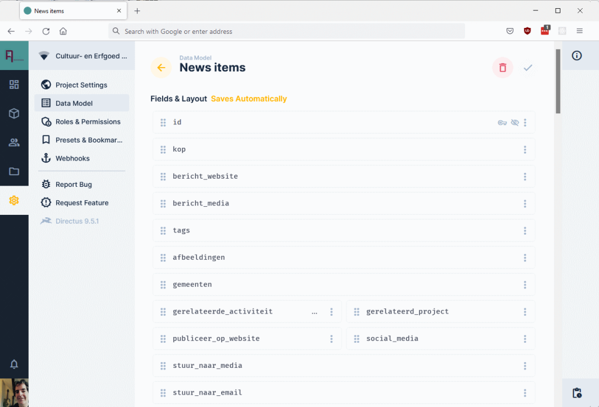
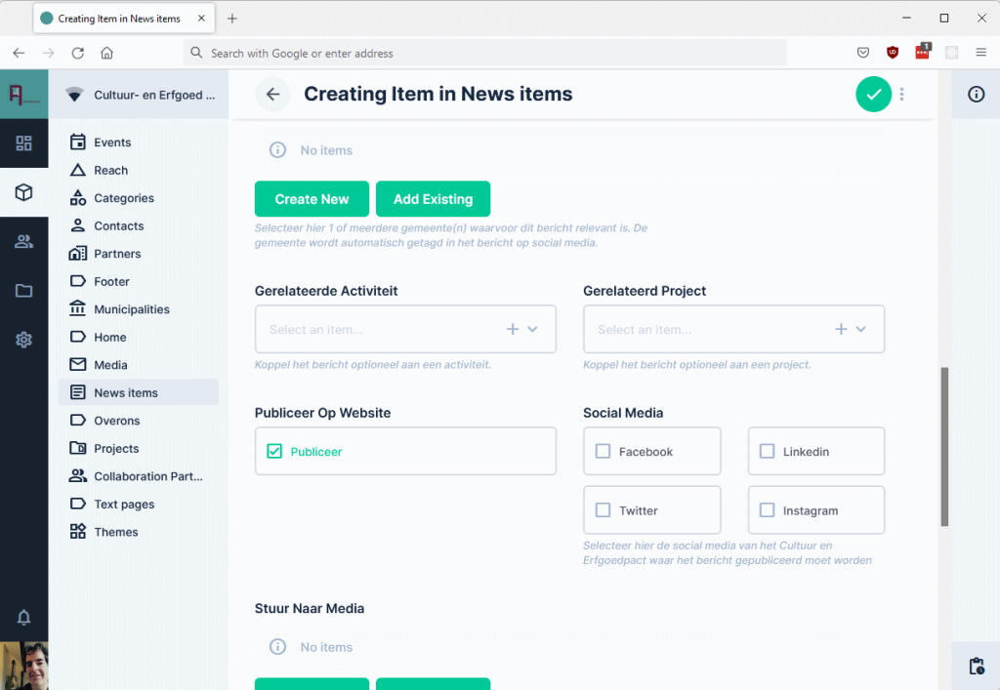
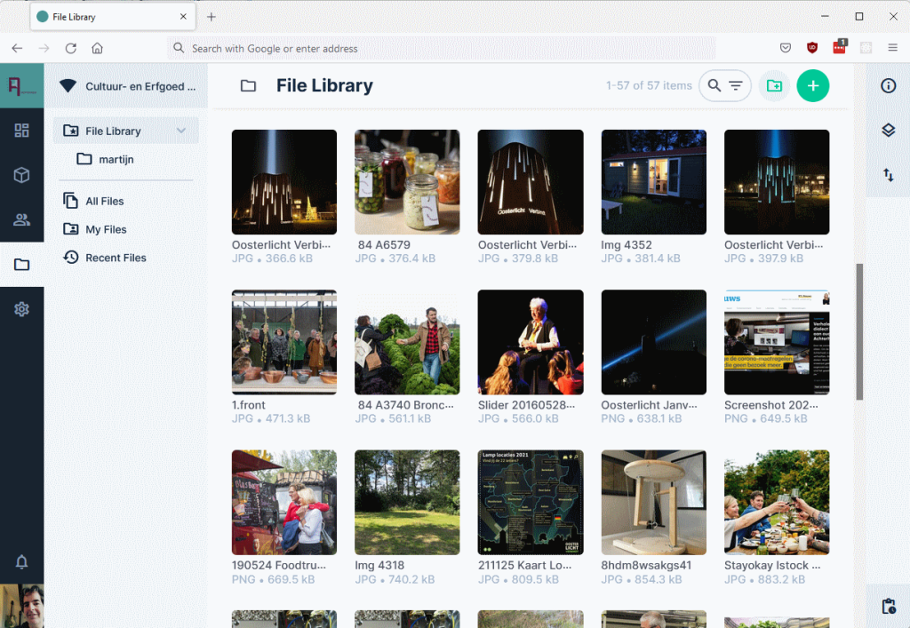
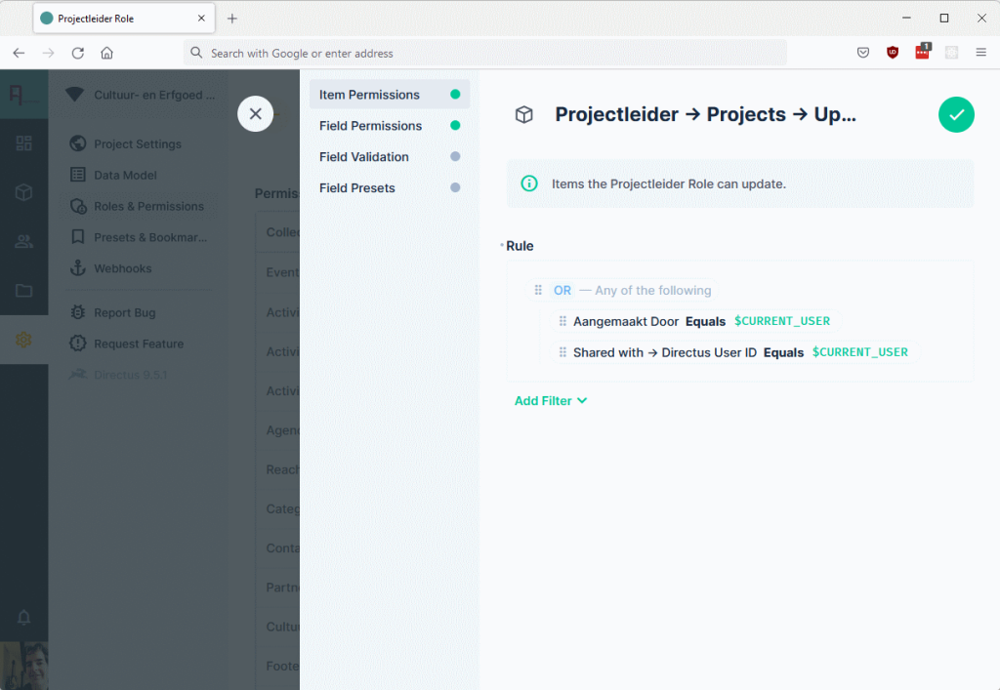
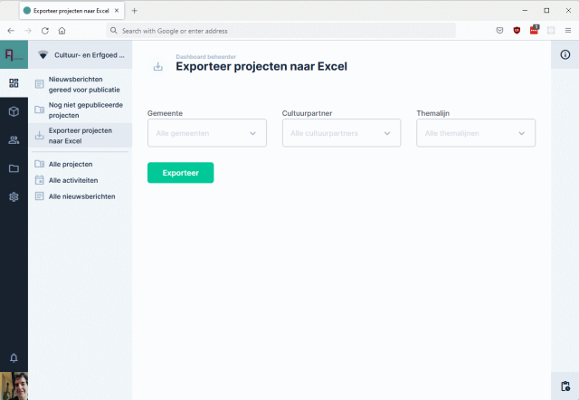

…or how to cut down custom application development time and save money get productive.

Imagine, you’re a software developer and you’re super excited to start this new fancy project. Then, you find out that 80 percent of the work involves coding the **backend** with 40 maintenance screens just for managing data, with hardly any business logic, except some authorization rules.

Yep, another boring forms-over-data application…

### Context

With our company, [Taiga](http://taiga.nl/en), we have been building custom software for more than 15 years. Frontend, backend, integrations and most of it on the Microsoft .NET platform with C#. _All custom software_.

While this worked out fine for a lot of projects, we recognized that for some projects, especially administrative applications, developing custom software is relatively time-consuming and expensive. But we never really found a good alternative for custom software. Existing low-code platforms can be a great solution for some companies, but unfortunately these have never been a great fit for _our_ customers. Too expensive, not enough flexibility and the possible risk of vendor lock-in.

However, last year, more or less by accident, we discovered an Open Source product, [Directus](http://directus.io) that really hit the sweet spot for us. Lots of built-in functionality but completely Open Source and super-flexible. Since that time, Directus has replaced some of the custom (backend) software we used to build for our customers and has allowed us to deliver results faster and much more cost-efficient.

This post is an introduction to Directus together with some of our real-world experiences.

### What is Directus?

Originally, we stumbled upon Directus because we were looking for a [headless Content Management System (CMS)](https://en.wikipedia.org/wiki/Headless_content_management_system) with strong authorization capabilities, but it turned out to more than that.

From the [directus.io](http://directus.io) website:

> Directus is the world's first Open Data Platform for instantly turning any SQL database into an API and beautiful no-code app.

Personally, I’d like to think of it as a **Data Management Application** more than a **Content Management System**. A data management application for relational databases.

By installing Directus you get:

- A management interface for your data model (called ‘collections’) and forms 
- A management interface for the data itself 
- Files management – upload images, movies, on-the-fly image resize 
- User and roles management
- Permissions management (define for each role which fields and items can be accessed, updated and deleted) 
- A REST and GraphQL API for other systems to work with the data
- Database support for PostgreSQL, MySQL, MS SQL Server, SQLite and more

It’s possible to create your data structures in Directus (and generate derived database tables), however, an unique feature of Directus is the possibility to work the other way around: point it to an existing database and reverse engineer the data structures by analyzing the database, including relations.

### Nice, a product to manage databases but our customer wants proper custom software…

And this is where Directus shines. There are so many [extensibility points](https://docs.directus.io/extensions/introduction/) in Directus that enable you to completely bend it to your will. Its user interface is built with [Vue.js](https://vuejs.org/) and you can build your own custom Vue components that integrate in Directus on different levels from [display components](https://docs.directus.io/extensions/displays/) (for example, a progress bar) to complete [Vue.js applications](https://docs.directus.io/extensions/modules/).

On the server-side, you can extend Directus with custom Node.js [hooks](https://docs.directus.io/extensions/hooks/) and API [endpoints](https://docs.directus.io/extensions/endpoints/)(written in JavaScript).

The screenshot above shows a custom Excel export function we built for in our first project (custom Directus module that calls a custom Directus endpoint).

### Integration story

In cases where extending the Directus user interface is not ‘custom’ enough, you can easily build a custom application that leverages the Directus REST or GraphQL API’s. It blew our minds how easy this is with [the Directus JavaScript SDK](https://docs.directus.io/reference/sdk/) when developing JavaScript frontend apps.

On a different level: one important aspect of Directus is that in the end, all data is stored nicely in a relational database (tables with foreign keys and all) and not in some proprietary format. Instead of communicating with the Directus API’s you could communicate with the database directly from your custom applications. It’s not something I’d immediately recommend, but it is good to know that the data is always accessible, even if Directus is not being used anymore for whatever reason.

### Real world examples

It’s hard to describe a product in a limited amount of words. A brief description of two projects we built with Directus in the past year (2021) will hopefully provide a bit of insight where Directus could fit in your own projects.

#### Example 1 - project administration platform with portfolio website

This project got us started with Directus in the first place. We received a request to build a project administration platform for a non-profit organization where users can only manage and see their own projects. Reports are then generated over all projects. It should also serve as the source for a public portfolio website. That last requirement screamed ‘headless CMS’ so we went out to see if any of the headless CMS offerings could serve as the foundation for the project administration platform.

Needless to say that the budget was limited and time constrained so the alternative of a bespoke custom application (our usual solution) did not look too promising.

Enter Directus.

We were able to model the data structure of the projects in Directus, but most important, we could easily implement the security requirement that users can only work with their own data and can not see nor edit other people’s data. Later we added an extra option to share a project with other users, so multiple users can work with the same data, but still restricted.

Details:

- All users work in the Directus admin app
- Custom [Vue.js](https://vuejs.org/) dashboards for each role
- Fine-grained permissions
- Custom e-mail notifications with hooks
- [Public portfolio website](https://cultuurerfgoedachterhoek.nl) built with Next.js that uses the Directus JS SDK
- Cloud-hosted, PostgreSQL 12 database, 30 database tables

#### Example 2 - e-learning platform and company website

Shortly after finishing the first project, a request arrived for a (relatively simple) custom e-learning platform. One caveat: it had to be production-ready in one month.

Again, the question came up: custom development or use an existing product. With our positive recent Directus experiences this turned out to be a no-brainer, also because existing e-learning products turned out to be way too complex in this case.

Within a few days, the backend was fully operational, so administrators could already start creating and uploading the course material, while we could concentrate on the custom frontend.

At the same time, a new public website was designed. Since Directus was already in place, it turned out to be convenient to use it as backend for the public website as well.

Details:

- Simple Directus configuration – only administrators work in the Directus app
- Next.js e-learning frontend single page application, uses Directus JS SDK
- Instruction video’s are uploaded to [Cloudflare Stream](https://www.cloudflare.com/products/cloudflare-stream/) from a Directus hook
- [Public Next.js website](https://erfgoedverbindtoldenzaal.nl) that uses Directus JS SDK (Dutch)
- Cloud-hosted, PostgreSQL 12

### Wrapping up

The main reason we always did custom application development, even for ‘boring’ administrative software was to stay 100% in control so we could deliver _any_ functionality our customers possibly want. I honestly think we did pretty well in this regard, but recent experiences with Directus made us think again whether custom development is always the best solution to build applications.

We simply could not have delivered this amount of value for our customers with custom development only.

Question is: what do we sacrifice by not having full control over everything? Probably time will tell when maintenance and possible new features kick in, but the overall development experience until now has been very good. And most important, we’ve never felt restricted in delivering value.

Lastly, thanks to Ben, Rijk and the rest of the [Directus team](https://directus.io/organization/) for their super efforts! Go visit the [Directus website](https://directus.io) or [GitHub](https://github.com/directus/directus) for much more information.
