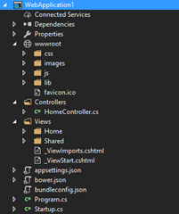
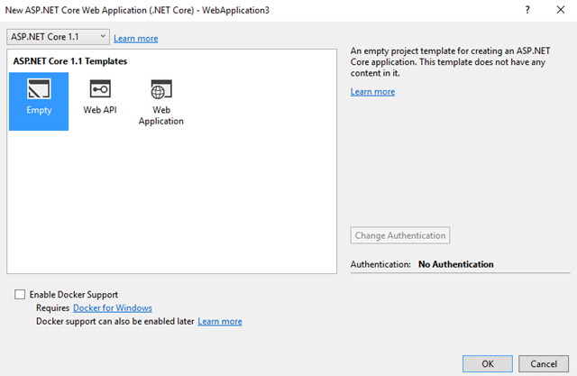
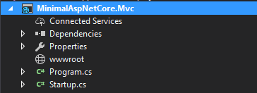
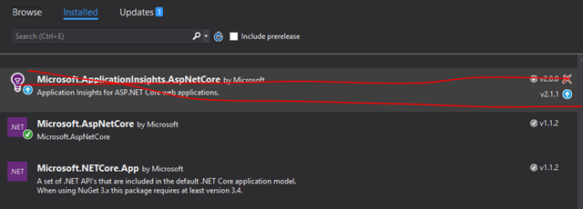
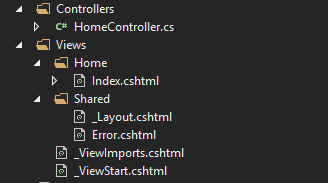
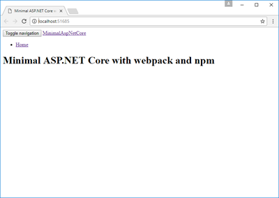
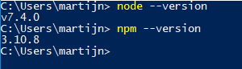
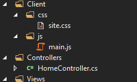
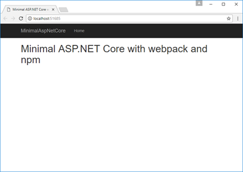

_Update: this post is written using ASP.NET Core 1.1. With ASP.NET Core 2.0, things have gotten easier. [See the updated version of this post for ASP.NET Core 2.0](https://blogs.taiga.nl/martijn/2017/11/24/building-and-asp-net-core-mvc-app-with-npm-and-webpack-asp-net-core-2-0-edition/)._



Recently, I was building a [ASP.NET Core MVC](https://www.asp.net/core/overview/aspnet-vnext) app. Everything went smooth, except for the default ASP.NET Core Web application template. I think, it’s a bit bloated and it still uses [Bower](https://bower.io/) for managing client-side libs where the rest of the world uses [NPM](https://www.npmjs.com/). It also leverages [BundlerMinifier](https://github.com/madskristensen/BundlerMinifier) to bundle and minify client assets which lacks in functionality, especially compared to something like [webpack](https://webpack.js.org/), which I use quite a lot these days. Simply said: I just want to use NPM and webpack in my ASP.NET projects. So there I went again, ripping out and replacing things while thinking:

> Wouldn’t it be easier to just start with the emptiest of templates and build from there?

This post reflects my findings while building a minimal ASP.NET Core MVC app from scratch with Visual Studio 2017 and is divided into the following parts:

- [Step 0: Remove application insights](#step0)
- [Step 1: Add MVC, StaticFiles and configuration infrastructure](#step1)
- [Step 2: Add controller, views and a layout](#step2)
- [Step 3: Add client-side libs from NPM](#step3)
- [Step 4: Bundle with webpack](#step4)
- [Step 5: Publish](#step5)

A little bit of knowledge of ASP.NET MVC and Visual Studio is assumed. If you already know how to create an ASP.NET Core MVC app from scratch or if you’re mainly interested in the NPM/webpack thing you might skip the first paragraphs and jump right to step 3.

The source code of the project is at [https://github.com/martijnboland/MinimalAspNetCore/tree/netcore-1.1](https://github.com/martijnboland/MinimalAspNetCore/tree/netcore-1.1 "https://github.com/martijnboland/MinimalAspNetCore/tree/netcore-1.1").

### Starting from scratch

**The goal of this exercise is to start with the empty ASP.NET Core template and add just enough to have a basic ASP.NET Core MVC app with a home page that is styled with [Bootstrap](http://getbootstrap.com/) and can be deployed to production environments.**

Let’s start with the empty template:



resulting in the following project:



### Step 0: Remove application insights

To start with a truly empty template we have to remove Application Insights from the project. No need for that right now. Also remove the line with .UseApplicationInsights() from Program.cs in the root of the project.

 

### Step 1: Add MVC, StaticFiles and configuration infrastructure

Add the following NuGet packages:

- Microsoft.AspNetCore.Mvc
- Microsoft.AspNetCore.StaticFiles

Next, we’ll add the files appsettings.json and appsettings.Development.json to the root of the project. These files contain our logging configuration, together with other configuration options. See [https://docs.microsoft.com/en-us/aspnet/core/fundamentals/configuration](https://docs.microsoft.com/en-us/aspnet/core/fundamentals/configuration "https://docs.microsoft.com/en-us/aspnet/core/fundamentals/configuration") for an overview of ASP.NET Core configuration and [https://docs.microsoft.com/en-us/aspnet/core/fundamentals/logging](https://docs.microsoft.com/en-us/aspnet/core/fundamentals/logging "https://docs.microsoft.com/en-us/aspnet/core/fundamentals/logging") for ASP.NET Core logging. The file Startup.cs is the place where everything is wired together:

```
public class Startup
{
    public Startup(IHostingEnvironment env)
    {
        var builder = new ConfigurationBuilder()
            .SetBasePath(env.ContentRootPath)
            .AddJsonFile("appsettings.json", optional: false, reloadOnChange: true)
            .AddJsonFile($"appsettings.{env.EnvironmentName}.json", optional: true);
        builder.AddEnvironmentVariables();
        Configuration = builder.Build();
    }

    public IConfigurationRoot Configuration { get; }

    public void ConfigureServices(IServiceCollection services)
    {
        services.AddMvc();
    }

    public void Configure(IApplicationBuilder app, IHostingEnvironment env, ILoggerFactory loggerFactory)
    {
        loggerFactory.AddConsole(Configuration.GetSection("Logging"));

        if (env.IsDevelopment())
        {
            app.UseDeveloperExceptionPage();
        }
        app.UseStaticFiles();
        app.UseMvcWithDefaultRoute();
    }
}

```

At this point we have our base infrastructure in place for ASP.NET Core MVC pages. However, running the application, now results in a 404 not found error. What we need are a controller, some views and a layout.

_As it turns out, this looks remarkably similar to the ASP.NET Core Web API template. An nice alternative is to take the Web API template as the starting point, and add the Microsoft.AspNetCore.StaticFiles NuGet package, together with adding app.UseStaticFiles() to Startup.cs._

### Step 2: Add controller, views and a layout

 for an introduction:

- Create folder ‘Controllers’ and add a file HomeController.cs with actions Index() and Error()
- Create folder ‘Views’ and add \_ViewStart.cshtml (Add New Item –> MVC View Start Page) and \_ViewImports.cshtml (Add New Item –> MVC View Imports Page)
- In the Views folder create the folders ‘Home’ and ‘Shared’
- Add ‘Index.cshtml’ to the ‘Views/Home’ folder and \_Layout.cshtml and Error.cshtml to the ‘Views/Shared’ folder

The layout page (\_Layout.cshtml) already has some bootstrap-specific markup:

```
<!DOCTYPE html>
<html>
<head>
    <meta charset="utf-8" />
    <meta name="viewport" content="width=device-width, initial-scale=1.0" />
    <title>@ViewData["Title"]</title>
</head>
<body>
<nav class="navbar navbar-inverse navbar-fixed-top">
    <div class="container">
        <div class="navbar-header">
            <button type="button" class="navbar-toggle" data-toggle="collapse" data-target=".navbar-collapse">
                <span class="sr-only">Toggle navigation</span>
                <span class="icon-bar"></span>
                <span class="icon-bar"></span>
                <span class="icon-bar"></span>
            </button>
            <a asp-area="" asp-controller="Home" asp-action="Index" class="navbar-brand">MinimalAspNetCore</a>
        </div>
        <div class="navbar-collapse collapse">
            <ul class="nav navbar-nav">
                <li><a asp-area="" asp-controller="Home" asp-action="Index">Home</a></li>
            </ul>
        </div>
    </div>
</nav>
<div class="container body-content">
    @RenderBody()
</div>
</body>
</html>

```

This results in a working page without styles:



To make this page a bit prettier, we’re adding [Bootstrap](http://getbootstrap.com/) (and [jQuery](https://jquery.com/) because the Bootstrap JavaScript plugins depend on jQuery).

### Step 3: Add client-side libs from NPM

Bootstrap and jQuery are installed from the NPM repository. NPM is the package manager of Node.js. We have to make sure that a reasonably recent version of [Node.js](https://nodejs.org) (version 6 or higher will do) is installed on our system and that it is on our path so we can run the node and npm commands from a console:



NPM requires a package.json file in the root of the project, so we’re adding that (Add New Item –> npm Configuration file, or from the command line in the root folder with ‘npm init’). After that, we’ll install our client libs with the following command (from the application root folder):

```
npm install –save jquery bootstrap
```

The libraries are installed, but how can we use these? The files are installed in the ‘node\_modules’ folder, but we cannot simply reference those in our layout page, because scripts and css files need to be in the ‘wwwroot’ folder. What we need is a tool that bundles all required client-side scripts and styles and copies the bundle to the ‘wwwroot’ folder.

### Step 4: Bundle with webpack

[Webpack](https://webpack.js.org) is becoming the standard for bundling and minification of client-side scripts, but it can do much, much more. Many people complain that setting up webpack is complex, but I honestly think that it is not. Let’s continue with our project.

For simplicity we’re going to create a single bundle that contains both our scripts and also our css styles. This way we only have to reference a single file in our layout page. The following code goes into the \_Layout.cshtml file just before the </body> tag (in Staging and Production environments, a version is added for cache busting):

```
<environment names="Development">
    <script src="~/dist/main.js"></script>
</environment>
<environment names="Staging,Production">
    <script src="~/dist/main.js" asp-append-version="true"></script>
</environment>
```

Thus our goal becomes to create a single bundle ‘main.js’ that goes into the ‘wwwroot/dist’ folder.

Add webpack and some loaders to our project:

```
npm install --save-dev webpack style-loader css-loader url-loader file-loader
```

After that we can add the [webpack configuration file](https://webpack.js.org/configuration/) to the root of our project (webpack.config.js):

```
var path = require('path');
var webpack = require('webpack');

module.exports = function (env) {

  env = env || {};
  var isProd = env.NODE_ENV === 'production';

  // Setup base config for all environments
  var config = {
    entry: {
      main: './Client/js/main'
    },
    output: {
      path: path.join(__dirname, 'wwwroot/dist'),
      filename: '[name].js'
    },
    devtool: 'eval-source-map',
    resolve: {
      extensions: ['.ts', '.tsx', '.js', '.jsx']
    },
    plugins: [
      new webpack.ProvidePlugin({ $: 'jquery', jQuery: 'jquery' })
    ],
    module: {
      rules: [
        { test: /\.css?$/, use: ['style-loader', 'css-loader'] },
        { test: /\.(png|jpg|jpeg|gif|svg)$/, use: 'url-loader?limit=25000' },
        { test: /\.(png|woff|woff2|eot|ttf|svg)(\?|$)/, use: 'url-loader?limit=100000' }
      ]
    }
  }

  // Alter config for prod environment
  if (isProd) {
    config.devtool = 'source-map';
    config.plugins = config.plugins.concat([
      new webpack.optimize.UglifyJsPlugin({
        sourceMap: true
      })
    ]);
  }

  return config;
};

```

The essential parts in the webpack configuration are the ‘entry’ and the ‘output’ fields. We’re basically saying: ‘analyze the entry file (‘Client/js/main’), resolve all references from there, put everything together in a single file and write that to the ‘wwwroot/dist’ folder with the name of the entry as file name (‘main.js’).

For the other config options, please check the [webpack configuration reference](https://webpack.js.org/configuration/) and the [loaders documentation](https://webpack.js.org/loaders/) to see what those are all about. It goes beyond the scope of this post to explain that all in detail.

. The file ‘Client/js/main.js’ contains:

```
import '../css/site.css';
import 'bootstrap/dist/css/bootstrap.css'
import 'jquery';
import 'bootstrap';
```

There is no code in this file apart from some ES6-style imports. However, exactly these imports are used by webpack to determine what goes into the bundle. Also notice that our css file and the bootstrap css file are imported just as if they were JavaScript files.

Now we can create the bundle, but how do we instruct webpack to do that? The easiest way to do it is by adding commands to the scripts section of the NPM package.json file:

```
"scripts": {
  "start": "webpack --config webpack.config.js --watch --progress --profile",
  "build": "webpack --config webpack.config.js --progress --profile",
  "prod": "webpack --env.NODE_ENV=production --config webpack.config.js --progress"
}

```

To create a development bundle enter:

```
npm run build
```

To create a minified production bundle:

```
npm run prod
```

During development, it’s convenient that bundles are updated when something changes. This can be accomplished with:

```
npm start
```

After having created the bundle with one of the above commands we see this when we run the application:



Looks like Bootstrap doesn’t it? :)

_Note: you can fully integrate the NPM commands in your Visual Studio workflow with the Task Runner Explorer and the [NPM task runner extension](https://marketplace.visualstudio.com/items?itemName=MadsKristensen.NPMTaskRunner)._

### Step 5: Publish

So there we have it. An ASP.NET Core MVC web application with NPM and webpack. Finally, we need something that creates our production bundle during publish. This can simply be done by just adding a few lines to the .csproj file:

```
<Target Name="BuildClientAssets" BeforeTargets="Publish">
  <Exec Command="npm install" />
  <Exec Command="npm run prod" />
</Target>

```

After having published the production bundle is in the wwwroot/dist/ folder of the published web app.

### And now?

Like this title already says: this is the minimal app. The source code is at [https://github.com/martijnboland/MinimalAspNetCore/tree/netcore-1.1](https://github.com/martijnboland/MinimalAspNetCore/tree/netcore-1.1 "https://github.com/martijnboland/MinimalAspNetCore/tree/netcore-1.1"). There is some room for improvement. The first thing to do is to extract the css from the production bundle and move that to its own file to prevent the flicker when loading the app. Also, when the app grows it’s probably wise to extract the shared vendor libraries into its own bundle. But this is probably something for a follow-up post.
