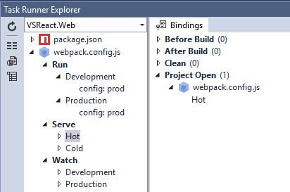
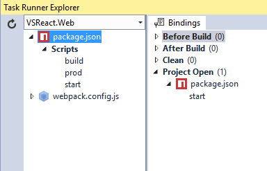
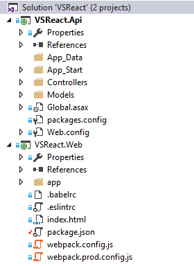
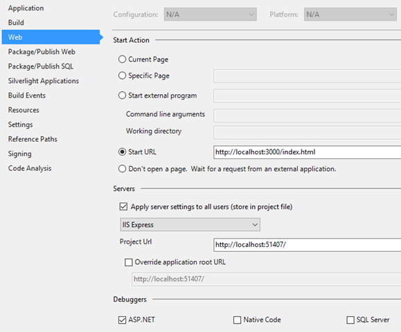

## _Update 2015-12-11_

_At about the same time this post was originally written, Mads Kristensen released the_ [_WebPack Task Runner_](https://visualstudiogallery.msdn.microsoft.com/5497fd10-b1ba-474c-8991-1438ae47012a) _extension. This post has been modified to reflect the new situation._

## _tl;dr_

_Developing ReactJS apps with an ASP.NET Web API back-end is not entirely straightforward. Most ReactJS apps use webpack to build and bundle the app and it’s also very convenient to leverage the hot module replacement abilities of the Webpack dev server. Visual Studio has no native support for webpack, but with the WebPack Task Runner or NPM Script Task Runner extensions it’s possible to integrate webpack with Visual Studio without the need to use the command-line.  
An example solution can be found at_ [_https://github.com/martijnboland/VSReact_](https://github.com/martijnboland/VSReact "https://github.com/martijnboland/VSReact")_._

These days, I mostly do front-end development with text editors and command-line tools. However, in some situations, especially when front-end and back-end are relatively tied together and the back-end is built with ASP.NET Web API, I find it more convenient to also use Visual Studio for front-end development because constantly switching between editors makes my head hurt.

## Visual Studio 2015 and the front-end

With Visual Studio 2015, Microsoft has made a shift towards the use of more open-source tooling for front-end development. JavaScript packages are now managed via [Bower](http://bower.io) instead of NuGet and the server-side bundling (System.Web.Optimization) is replaced with [Gulp](http://gulpjs.com) or [Grunt](http://gruntjs.com). Perfect for front-end JavaScript wouldn’t you say?

## ReactJS and its ecosystem

When developing apps with [ReactJS](https://facebook.github.io/react/) and Visual Studio, you could try to keep using Bower and Gulp/Grunt but it’s hard to find good guidance. Almost the entire ReactJS ecosystem uses [NPM](https://www.npmjs.com/) instead of Bower and [webpack](https://webpack.github.io/) instead of Gulp/Grunt. Do yourself a favor and go with the flow. NPM works fine and is probably already the number one package manager for the browser. Webpack is a bundler for scripts and static assets where Grunt/Gulp are task runners that can be configured with plugins to do the bundling. You can not say that one is better than the other(s) because they serve a slightly different purpose. Let’s just use NPM and webpack.

One issue though: how do we integrate webpack and NPM in Visual Studio? Luckily, NPM is already supported in Visual Studio 2015. No visual tooling like ‘Manage Bower Packages’ but editing the package.json file is easy with autocomplete for packages and versions and Visual Studio automatically installs the packages that are newly added or missing. That still leaves webpack.

## Running webpack from Visual Studio

We want to use webpack to bundle our JavaScript files and static assets, but webpack also comes with a very nice embedded webserver for development that serves the bundles and watches for changes. After saving a file, bundles are automatically recreated and served. On top of that, webpack has [hot module replacement](https://webpack.github.io/docs/hot-module-replacement-with-webpack.html) support that replaces code in a running app in your browser.  
Normally you’d execute webpack from the command line and this is still possible, but wouldn’t it be great if opening the Visual Studio solution also starts the webpack development server and you can start everything with a single F5?

Since version 2015, Visual Studio has the ‘[Task Runner Explorer](http://webtooling.visualstudio.com/task-runners/)’. Default it comes with support for Grunt and Gulp and you can link tasks to events like ‘Opened Project’ and ‘After Build’.  
The Task Runner Explorer can be extended and this is great because we now have two extension options to integrate webpack in Visual Studio.

### [WebPack Task Runner extension](https://visualstudiogallery.msdn.microsoft.com/5497fd10-b1ba-474c-8991-1438ae47012a)

This extension makes webpack integration super easy. The webpack configuration file (webpack.config.js) is automatically detected after opening the Task Runner Explorer (and it even detects alternative config files for different environments):

 [](https://blogs.taiga.nl/martijn/wp-content/uploads/Develop-ReactJS-apps-with-ASP.NET_C9B5/image_6.png)

In the above example, the ‘Serve Hot’ task is bound to ‘Project Open’, in other words, when opening the Visual Studio Solution, the webpack dev server is started with hot module replacement enabled.

### [NPM Scripts Task Runner extension](https://visualstudiogallery.msdn.microsoft.com/8f2f2cbc-4da5-43ba-9de2-c9d08ade4941)

An alternative for the WebPack Task Runner extension is the [NPM Scripts Task Runner](https://visualstudiogallery.msdn.microsoft.com/8f2f2cbc-4da5-43ba-9de2-c9d08ade4941) extension. Compared to the WebPack Task Runner extension, this extension is probably a little bit more flexible because you have to specify the webpack command line parameters yourself.

The extension allows us to execute the commands from the scripts section of the NPM package.json file:

```
"scripts": {
  "start": "webpack-dev-server --port 3000 --config webpack.config.js --hot --content-base build --progress --colors",
  "build": "webpack --config webpack.config.js --progress --profile --colors",
  "prod": "webpack -p --config webpack.prod.config.js --progress --colors"
```

**start**: run the webpack dev server with hot module replacement enabled  
**build**: run webpack to create bundles with the default configuration  
**prod**: run webpack to create optimized production bundles

The Visual Studio Task Runner Explorer:

[](https://blogs.taiga.nl/martijn/wp-content/uploads/Develop-ReactJS-apps-with-ASP.NET_C9B5/image_7.png)

You can see that the ‘start’ script is executed when the project is opened, which in our case means starting the webpack dev server with hot module replacement.

## A complete solution

In the intro I mentioned ASP.NET Web API. Often, a Visual Studio solution consists of at least one web project for the client application and static assets and another ASP.NET Web API project as the back-end.



On GitHub, you can find an example solution  ([https://github.com/martijnboland/VSReact](https://github.com/martijnboland/VSReact "https://github.com/martijnboland/VSReact")) that has these projects. It’s the well known TodoMVC app with an ASP.NET Web API backend.

VSReact.Api is the ASP.NET Web API project and VSReact.Web is the ReactJS app. Normally you would set both projects as startup projects, but in this case, VSReact.Web should not be started because the webpack dev server is already running and serving the client files.

_A special note: the VSReact.Web is still based on an empty ASP.NET project although there is zero ASP.NET in it. This is mainly to keep Visual Studio happy and enable the Task Runner Explorer._

For a true ‘hit F5 and run’ experience we have to do one last thing: point the start URL of the VSReact.**Api** project to the webpack dev server, in our case http://localhost:3000/index.html. Then, when you hit F5 or CTRL+F5, the API project builds and runs, but the browser opens nicely with the client app:

[](https://blogs.taiga.nl/martijn/wp-content/uploads/Develop-ReactJS-apps-with-ASP.NET_C9B5/image_5.png)

To run the example solution, you’ll need the following prerequisites:

- Visual Studio 2015
- NodeJS 4.0 or higher
- [WebPack Task Runner](https://visualstudiogallery.msdn.microsoft.com/5497fd10-b1ba-474c-8991-1438ae47012a) or [NPM Scripts Task Runner](https://visualstudiogallery.msdn.microsoft.com/8f2f2cbc-4da5-43ba-9de2-c9d08ade4941)

## Credits

The VSReact.Web project is a copy of the [example React + Redux + DevTools project](https://github.com/gaearon/redux-devtools/tree/master/examples/todomvc) and the VSReact.Api project is copied from [https://github.com/mforman/todo-backend-webapi](https://github.com/mforman/todo-backend-webapi "https://github.com/mforman/todo-backend-webapi"). Both with small modifications for the integration. Thanks to the original authors for the examples.
