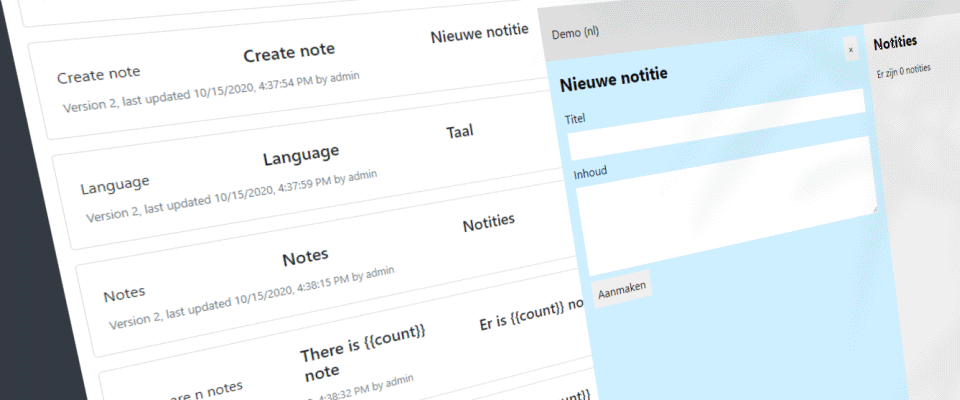
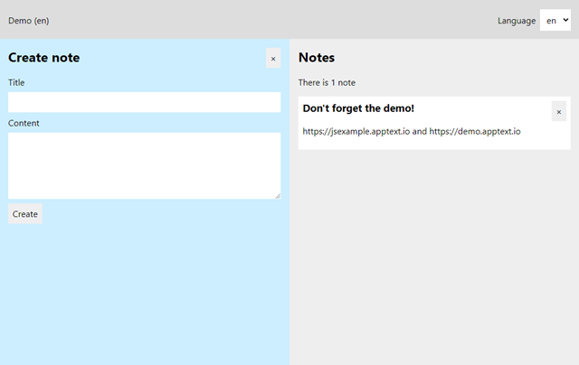
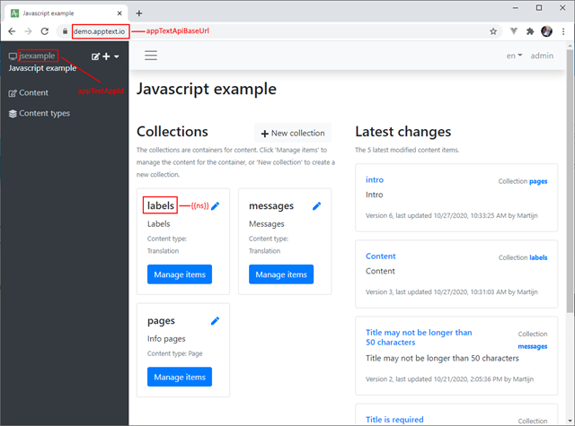
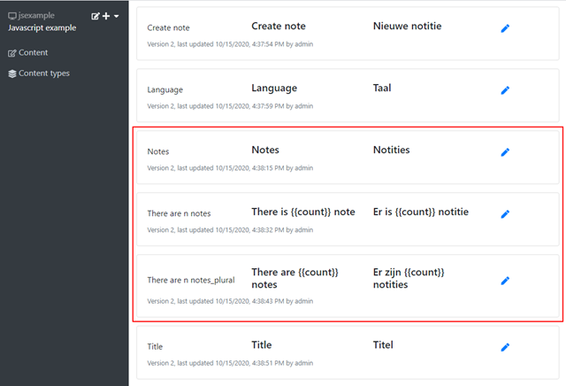

### 

### The case for dynamic localization

Ever built an application with a User Interface in multiple languages? Then you’ve probably experienced the situation where you, as developer, instantly had to fix some translations or add a new language. Often, these requests come at the most inconvenient times. Wouldn’t it be great if we could decouple translations and content of the application from the actual release cycle?

Enter [AppText](https://apptext.io).

AppText is a content management system specifically tailored towards applications. You can use it to manage translations (for labels, messages, etc.) but it also supports more complex content structures that you can define yourself (i.e. help pages).

With AppText and a little bit of custom code, you can easily add dynamic localization to your own applications. This post shows how to do this for JavaScript applications (actually, we’re using TypeScript, but all concepts apply to regular JavaScript as well).

### A React notes example application

The example application for this post is a simple [React](https://reactjs.org/) Single Page Application to take notes.



Nothing fancy, but just enough for a complete example. In this post specifically, we are going to localize the labels and error messages.

A working example application can be seen live at [https://jsexample.apptext.io](https://jsexample.apptext.io).

Go to [https://github.com/martijnboland/apptext/tree/main/examples/javascriptreactexample](https://github.com/martijnboland/apptext/tree/main/examples/javascriptreactexample "https://github.com/martijnboland/apptext/tree/main/examples/javascriptreactexample") to check out the complete source code for the example application. The readme also contains instructions how to setup AppText as backend for the example.

### Translating labels and messages with i18next

The [i18next library](https://www.i18next.com/) is my weapon of choice when it comes to JavaScript localization. It’s not tied to a specific framework and has plugins to cover probably all possible scenarios.

AppText comes with the Translations module that provides HTTP endpoints specifically tailored towards localization libraries. Configuring i18next to use AppText as backend for translations is super easy. We just use the [i18next-http-backend](https://github.com/i18next/i18next-http-backend) plugin. This is the i18next configuration of the example application:

```
[sourcecode language='javascript'  padlinenumbers='true']
import i18n from 'i18next';
import { initReactI18next } from 'react-i18next';
import Backend from 'i18next-http-backend';
import { appTextApiBaseUrl, appTextAppId, currentLanguageStorageKey, appTextApiKey } from './config';

const language = localStorage.getItem(currentLanguageStorageKey) || 'en';

i18n
  .use(Backend)
  .use(initReactI18next)
  .init({
    lng: language,
    fallbackLng: 'en',
    returnNull: false,
    backend: {
      loadPath: `${appTextApiBaseUrl}/${appTextAppId}/translations/public/{{lng}}/{{ns}}`,
      customHeaders: {
        'X-Api-Key': appTextApiKey,
        // ...
      },
    },
    debug: true,
    ns: ['labels', 'messages'],
    defaultNS: 'labels'
  });


export default i18n;
[/sourcecode]

```

This is a straightforward configuration for i18next in a React application.

The AppText-specific part of the configuration above is in the **backend** property of the init() options:

```
[sourcecode language='javascript'  padlinenumbers='true']
backend: {
  loadPath: `${appTextApiBaseUrl}/${appTextAppId}/translations/public/{{lng}}/{{ns}}`,
  customHeaders: {
    'X-Api-Key': appTextApiKey
  },
}
[/sourcecode]

```

The **loadPath** property points to the AppText [Translations endpoint](https://apptext.io/docs/api-public#get-translations). To access this endpoint, an [ApiKey](https://apptext.io/docs/api-keys) is required.  We add this key with a custom HTTP Header **X-Api-Key**.

You can see a few variables in the loadPath that require some explanation:

<table cellspacing="0" cellpadding="2" width="346" border="0"><tbody><tr><td valign="top" width="150">appTextApiBaseUrl</td><td valign="top" width="194">The base address of the AppText installation (e.g. <a href="https://demo.apptext.io">https://demo.apptext.io</a>)<br></td></tr><tr><td valign="top" width="150">appTextAppId</td><td valign="top" width="194">The id of the AppText app that contains the context (e.g. ‘jsexample’)</td></tr><tr><td valign="top" width="150">{{lng}}</td><td valign="top" width="194">The language for the translation. This is dynamically set by i18next</td></tr><tr><td valign="top" width="150">{{ns}}</td><td valign="top" width="194">The i18next namespace for the translation. This corresponds with an AppText collection and is dynamically set by i18next</td></tr></tbody></table>

Let’s say that i18next is going to load all translations with namespace ‘labels’ and language ‘en’. The actual loadPath (which is the AppText endpoint url) then becomes: [https://demo.apptext.io/jsexample/translations/public/en/labels](https://demo.apptext.io/jsexample/translations/public/en/labels).

Below you can see how the variables relate to the AppText Admin interface.

That’s all we need to do to integrate i18next with AppText.

Displaying the translations in the components is straightforward i18next. In our example with use the useTranslation hook from the ‘react-i18next’ package. A nice example is the Notes list component:

```
[sourcecode language='javascript' ]
import React from 'react';
import { useTranslation } from 'react-i18next';
import { Note } from './models';

interface ListProps {
  notes: Note[],
  onRemoveNote(note: Note): void 
}

const List: React.FC = ({ notes, onRemoveNote }) => {
  const { t } = useTranslation('labels');

  return (
    
      {t('Notes')}
      {t('There are n notes', { count: notes.length })}
      {notes.map((note, idx) => 
        
          
            {note.title}
            
               onRemoveNote(note)}>×
            
          
          {note.content}
        
      )}
    
  )
}

export default List;
[/sourcecode]

```

The Notes component has two labels that are displayed with the i18next ‘t’ function that comes from the useTranslation hook:

```
[sourcecode language='javascript' ]
      {t('Notes')}
      {t('There are n notes', { count: notes.length })}
[/sourcecode]

```

In AppText, these translations are in the ‘labels’ collection:



Note that the keys for the translations are in natural language, but we could just use synthetic keys. Also, we’re using the [i18next pluralization](https://www.i18next.com/translation-function/plurals) feature with the translation for key ‘There are n notes’.

### What about complex content?

Sometimes, we want to display more complex content in our applications, for example, help or information pages.  Can we use i18next for those as well? In theory, yes, but with AppText we have more options with custom content types and the GraphQL API. That’s something we’ll cover in the [next post](https://blogs.taiga.nl/martijn/2020/11/02/dynamic-localization-of-javascript-apps-with-apptext-part-2-graphql/).
