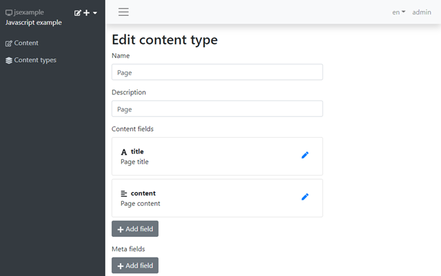
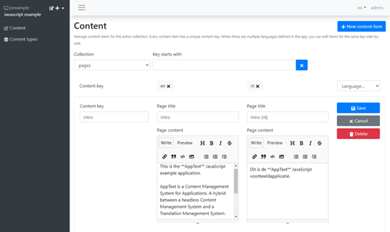
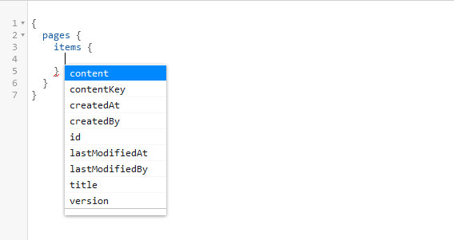
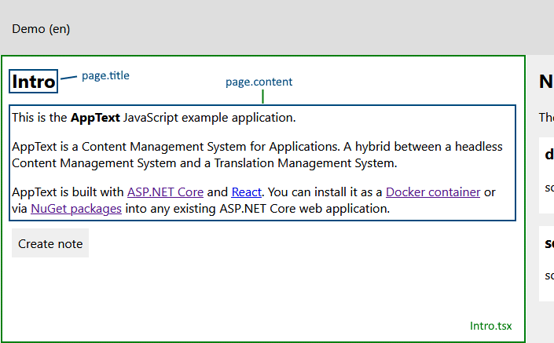

This post is part of a series of post about AppText, a Content Management System for applications. Earlier posts:

- [Easy ASP.NET Core localization with AppText](https://blogs.taiga.nl/martijn/2020/08/03/easy-asp-net-core-localization-with-apptext/)
- [Dynamic localization of JavaScript apps with AppText](https://blogs.taiga.nl/martijn/2020/10/29/dynamic-localization-of-javascript-apps-with-apptext-and-i18next/)

In the [previous post](https://blogs.taiga.nl/martijn/2020/10/29/dynamic-localization-of-javascript-apps-with-apptext-and-i18next/) we translated labels and messages in a JavaScript example application with i18next. AppText covers this with the built-in ‘Translation’ content type that simply has a single field: ‘text’.

Sometimes however, applications have the need for more sophisticated content, for example, in help or information pages. These pages contain multiple paragraphs, require formatting and perhaps contain links to other pages. For these scenarios, just having a singe field ‘text’ simply won’t cut it anymore.

In AppText, you can define your own [content types](https://apptext.io/docs/concepts#content-type) that can contain as many fields as you wish. Displaying the content for these custom content types requires a different approach than just using a localization library such as i18next. This post shows how to leverage  the GraphQL API of AppText to display content for custom content types (and more!).

Also check out the source code of the example application at  [https://github.com/martijnboland/apptext/tree/main/examples/javascriptreactexample](https://github.com/martijnboland/apptext/tree/main/examples/javascriptreactexample "https://github.com/martijnboland/apptext/tree/main/examples/javascriptreactexample").

### Custom content type – an example

Our [example JavaScript application](https://github.com/martijnboland/apptext/tree/main/examples/javascriptreactexample) contains an Intro component that displays an intro page with a title and content with markup. In AppText, we created a custom ‘Page’ content type with 2 fields: title (short text) and content (long text):

[](https://blogs.taiga.nl/martijn/wp-content/uploads/2020/10/apptext-page-content-type_thumb2.png)

_(Note: the short text field can contain max. 500 characters and no formatting where the long text field can contain an unlimited amount of characters and allows [Markdown](https://github.com/adam-p/markdown-here/wiki/Markdown-Cheatsheet) formatting. Besides short text and long text, AppText also has number and date(time) fields)_

With the ‘Page’ content type, we then created a ‘pages’ collection where we can edit the content for the Intro page. Note that the ‘Page content’ field allows markdown (in AppText all long text fields can contain Markdown):

[](https://blogs.taiga.nl/martijn/wp-content/uploads/2020/10/apptext-edit-intro_thumb2.png)

We can retrieve content of collections with a custom content type such as our pages collection via the REST API or the GraphQL API. In essence, we’re now using AppText as a [Headless CMS](https://en.wikipedia.org/wiki/Headless_content_management_system).

### Retrieving content with GraphQL

Before showing how to read and display content from AppText with GraphQL, first a brief introduction about the GraphQL API itself.

[](https://blogs.taiga.nl/martijn/wp-content/uploads/2020/11/graphql-pages.png)

The GraphQL schema in AppText is partly dynamic. The top-level fields are the collections (**pages** in the example above). Per collection, you can query collection-specific fields (incl. content type) but also traverse into the **items** field, which represent [content items](https://apptext.io/docs/concepts#content-item). This is where you query the actual content. A content item has some fixed fields like **contentKey** and **version** but also has the fields as defined in the content type. In the example above, **content** and **title** are those dynamic fields.

Our JavaScript example app uses the GraphQL API to retrieve to content for the intro page with the help of the [urql](https://formidable.com/open-source/urql/) library. For this, we have created a graphQLClient to connect to our AppText GraphQL API:

```
import { createClient } from 'urql';

import { appTextApiBaseUrl, appTextAppId, appTextApiKey } from './config';

const client = createClient({
  url: `${appTextApiBaseUrl}/${appTextAppId}/graphql/public`,
  fetchOptions: () => {
    return {
      headers: { 'X-Api-Key': appTextApiKey },
    };
  },
});

export default client;
```

The url property of the client options object points to the AppText GraphQL api. Every AppText App has its own GraphQL url. For example, the GraphQL url of the official JavaScript demo is [https://demo.apptext.io/jsexample/graphql/public](https://demo.apptext.io/jsexample/graphql/public). The **X-Api-Key** HTTP header is required and defined in the AppText admin UI in the App properties.

This client is added to our example application in the top-level component (App.tsx) via the [urql Provider component](https://formidable.com/open-source/urql/docs/basics/getting-started/#providing-the-client).

```
[sourcecode language='javascript'  padlinenumbers='true']
import React, { Suspense, useRef, useState } from 'react';
import { Provider as GraphQLProvider } from 'urql';
import graphQLClient from './localization/graphQLClient';
// other imports

function App() {

  // Snip App init code

  return (
    
      
        
           ...
        
      
    
  );
}
[/sourcecode]

```

With the GraphQL client in place, we can now query the GraphQL API for content. For convenience, the example application has a useAppTextPage hook that encapsulates the GraphQL querying of the **pages** collection:

```
import { useQuery } from 'urql';

const AppTextPageQuery = `
  query ($language: String!, $contentKey: String) {
    pages {
      items(contentKeyStartsWith:$contentKey, first:1) {
        contentKey
        title(language:$language)
        content(language:$language)
      }
    }
  }
`;

export function useAppTextPage(contentKey: string, language: string) {
  const [{ data, fetching, error }] = useQuery({
    query: AppTextPageQuery,
    variables: { language: language, contentKey: contentKey }
  });

  const page = data && data.pages && data.pages.items.length > 0
    ? data.pages.items[0]
    : null;

  if (error) {
    console.error(error);
  }
  return { page, fetching, error };
}
```

Note that the GraphQL query, **AppTextPageQuery**, receives two variables, $language and $contentKey, to allow filtering the content items for a single page and then only fetching content for the specified language.

### Display localized content

In our example application, we have a component, Intro.tsx that displays simple translations via i18next, but also custom content via the useAppTextPage hook:

```
[sourcecode language='javascript' ]
import React from 'react';
import { useTranslation } from 'react-i18next';
import ReactMarkdown from 'react-markdown';
import Loader from './loader/Loader';
import { useAppTextPage } from './localization/useAppTextPage';

interface IntroProps {
  onCreateNote(): void
}

const Intro: React.FC = ({ onCreateNote }) => {
  const { t, i18n } = useTranslation(['labels','messages']);
  const { page, fetching, error } = useAppTextPage('intro', i18n.language);

  return (
    
      {page
        ? 
        
          {page.title}
          
          {t('labels:Create note')}
        
        : fetching
          ? 
          : {t('messages:Page not found', { contentKey: 'intro' })}
      }
      {error &&
        {error.message}
      }
    
  )
}

export default Intro;
[/sourcecode]

```

The custom content is retrieved with the **useAppTextPage** hook:

const { page, fetching, error } = useAppTextPage('intro', i18n.language);

This will get the content for the page where the contentKey starts with ‘intro’ and for the currently selected language, resulting in a **page** object with **title** and **content** properties that is rendered in the component:

[](https://blogs.taiga.nl/martijn/wp-content/uploads/2020/11/apptext-intro.png)

The page.content is rendered with the [ReactMarkdown](https://remarkjs.github.io/react-markdown/) component to safely convert the Markdown into HTML.

### More GraphQL: languages

Besides the collections, the AppText GraphQL API also has two other useful top-level fields: **languages** and **defaultLanguage**. These are properties of the AppText [App](https://apptext.io/docs/concepts#app) object.

In our JavaScript example, we use this in our LanguageSelector component to display the list of available languages. Check the **LanguagesQuery**:

```
[sourcecode language='javascript' ]
import React from 'react';
import { useTranslation } from 'react-i18next';
import { useQuery } from 'urql';
import Loader from '../loader/Loader';
import { currentLanguageStorageKey } from './config';

const LanguagesQuery = `
  query {
    languages
    defaultLanguage
  }
`;

const LanguageSelector: React.FunctionComponent = () => {
  const { i18n, t } = useTranslation();

  const [{ data, fetching, error }] = useQuery({
    query: LanguagesQuery,
  });

  const currentLanguage = i18n.language;

  const changeLanguage = (e: React.ChangeEvent) => {
    const newLanguage = e.target.value;
    i18n.changeLanguage(newLanguage)
      .then(() => { 
        localStorage.setItem(currentLanguageStorageKey, newLanguage);
      });
  }

  return fetching
    ?
      
    :
      error
      ?
        {error.message}
      :
        
          {t('Language')}
          
            {data.languages.map((lang:string) => {lang})}
          
        
};

export default LanguageSelector;
[/sourcecode]

```

You can see that the LanguageSelector component also uses i18next (via the useTranslation hook), not only to for the label translation, but also to set the current language for the application.

### Try it yourself

All code in this and the [previous](https://blogs.taiga.nl/martijn/2020/10/29/dynamic-localization-of-javascript-apps-with-apptext-and-i18next/) post is on GitHub. You can try it by cloning the [AppText repository](https://github.com/martijnboland/apptext). The JavaScript/React example is in the [/examples/javascriptreactexample](https://github.com/martijnboland/apptext/tree/main/examples/javascriptreactexample) folder and we have a [demo Docker container](https://hub.docker.com/r/apptextio/apptext-demo) prepared as AppText backend for the example app.
