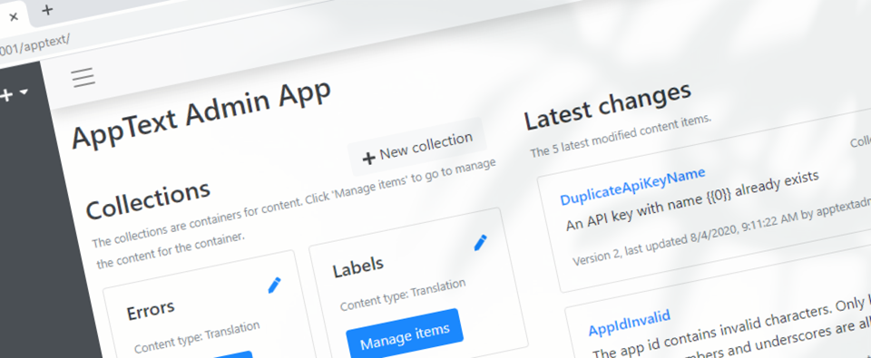
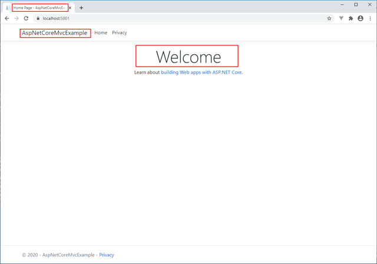
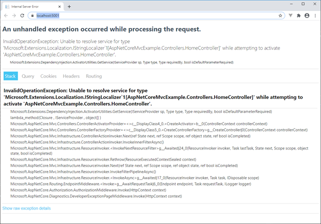
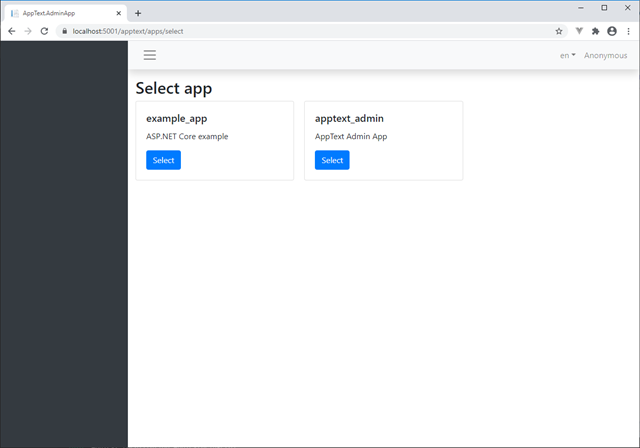
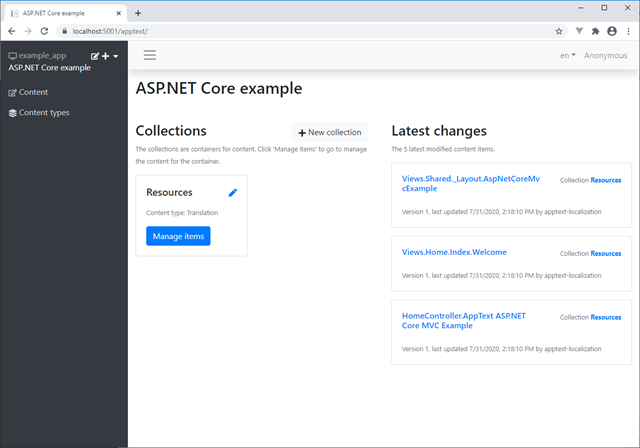
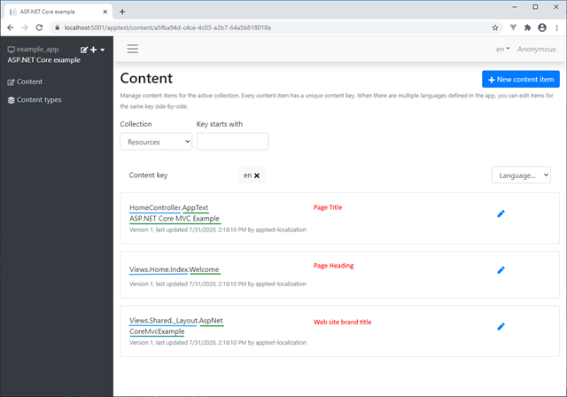
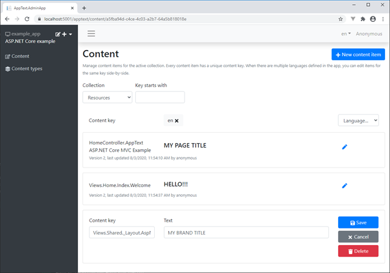
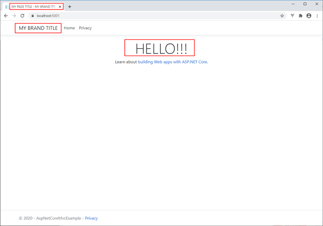
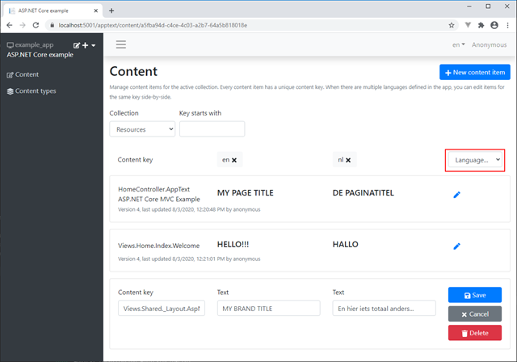
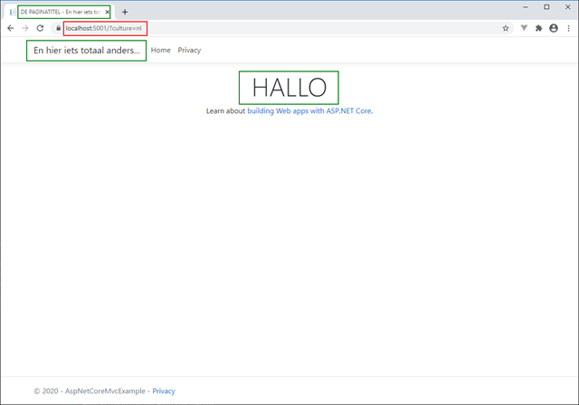

### What is AppText?

[AppText](https://apptext.io) is a simple Open Source Content Management System (CMS) that I started as a side project to make it easier for our customers and ourselves to do small textual changes in applications without having to build and release new versions of the applications all the time.

It runs on the Microsoft ASP.NET Core platform where it’s installed as add-on to ASP.NET Core web applications via NuGet packages. More information about AppText can be found at the web site ([https://apptext.io](https://apptext.io)) and GitHub ([https://github.com/martijnboland/apptext](https://github.com/martijnboland/apptext)).

Because it’s still early in its development, documentation is a bit sparse and we’re still figuring out some usage scenarios, but there is one area that already works great (I think) and that’s the integration with the [ASP.NET Core Localization](https://docs.microsoft.com/en-us/aspnet/core/fundamentals/localization?view=aspnetcore-3.1) components.

This post shows how to enable localization in ASP.NET Core applications with AppText. The final code for this post is also on GitHub in the [/examples/AspNetCoreMvcExample](: https://github.com/martijnboland/apptext/tree/main/examples/AspNetCoreMvcExample) folder. All feedback is very much appreciated!

### Setup example application

We’re going to create an example ASP.NET Core MVC application and replace static text with localized resources from AppText.

Let’s begin with the empty MVC app:

```
dotnet new mvc
```

Followed by:

```
dotnet run
```

Opening the browser and navigating to [https://localhost:5001](https://localhost:5001) shows the default home page of an ASP.NET Core MVC project:



Highlighted above are three text resources that we’re going to localize:

- The page title in the title bar
- The website brand title (AspNetCoreMvcExample) 
- The page heading (Welcome)

### Localization

ASP.NET Core has [standard components for localization](https://docs.microsoft.com/en-us/aspnet/core/fundamentals/localization?view=aspnetcore-3.1) and in our example we’ll start with these standard components. The page title is localized via the controller with the IStringLocalizer and the website brand title and the page heading directly in the Razor view with the IViewLocalizer.

Page title in Controllers/HomeController.cs:

```
public class HomeController : Controller
{
    private readonly ILogger<HomeController> _logger;
    private readonly IStringLocalizer<HomeController> _localizer;

    public HomeController(ILogger<HomeController> logger, IStringLocalizer<HomeController> localizer)
    {
        _logger = logger;
        _localizer = localizer;
    }

    public IActionResult Index()
    {
        ViewData["Title"] = _localizer["AppText ASP.NET Core MVC Example"];
        return View();
    }
}

```

Brand title in Views/Shared/\_Layout.cshtml:

```
@using Microsoft.AspNetCore.Mvc.Localization
@inject IViewLocalizer L
<!DOCTYPE html>
<html lang="en">
<head>
    <meta charset="utf-8" />
    <meta name="viewport" content="width=device-width, initial-scale=1.0" />
    <title>@ViewData["Title"] - @L["AspNetCoreMvcExample"]</title>
    <link rel="stylesheet" href="~/lib/bootstrap/dist/css/bootstrap.min.css" />
    <link rel="stylesheet" href="~/css/site.css" />
</head>
<body>
    <header>
        <nav class="navbar navbar-expand-sm navbar-toggleable-sm navbar-light bg-white border-bottom box-shadow mb-3">
            <div class="container">
                <a class="navbar-brand" asp-area="" asp-controller="Home" asp-action="Index">@L["AspNetCoreMvcExample"]</a>


```

Page heading in Views/Home/Index.cshtml:

```
@using Microsoft.AspNetCore.Mvc.Localization
@inject IViewLocalizer L
<div class="text-center">
    <h1 class="display-4">@L["Welcome"]</h1>
    <p>Learn about <a href="https://docs.microsoft.com/aspnet/core">building Web apps with ASP.NET Core</a>.</p>
</div>


```

Now, when running the application again, we get an error message that IStringLocalizer can not be resolved:



This is because we didn’t register the localization services in Startup.cs yet. Adding these to Startup.cs fixes the error message:

```
public void ConfigureServices(IServiceCollection services)
{
    services.AddLocalization();

    services.AddControllersWithViews()
        .AddViewLocalization();
}


```

The application is now set up to use .resx resource files for localization. In this post, we won’t get into detail how this works. [Look here](https://docs.microsoft.com/en-us/aspnet/core/fundamentals/localization?view=aspnetcore-3.1#resource-files) for more information.

A major drawback of this localization method is that every little change requires a new build of your application. There is no way to change resources in an already deployed application. This is the main reason why AppText was created, to enable changing text resources in deployed applications without having to build and deploy new versions.

### Enable dynamic localization with AppText

Adding AppText for localization is very easy. Just two NuGet packages and a little bit of configuration in the Startup.cs file. For ASP.NET Core localization we need the AppText.Localization package and we also need the AppText.AdminApp package enable management of the text resources.

Add the NuGet packages:

```
dotnet add package AppText.Localization
```

```
dotnet add package AppText.AdminApp
```

Then change Startup.cs to enable AppText localization. We also inject IHostEnvironment via the constructor because we need it to resolve the physical folder where the AppText is running for its file storage:

```
public class Startup
{
    public Startup(IConfiguration configuration, IHostEnvironment env)
    {
        Configuration = configuration;
        Env = env;
    }

    public IConfiguration Configuration { get; }
    public IHostEnvironment Env { get; }

    public void ConfigureServices(IServiceCollection services)
    {
        // Add AppText
        var dataPath = Path.Combine(Env.ContentRootPath, "App_Data");

        services.AddAppText()
            // Use simple JSON file storage
            .AddNoDbStorage(dataPath)
            // Admin api is available at /apptext
            .AddAdmin()
            // Initialize an app with languages and default language in AppText where the content is stored
            .InitializeApp("example_app", "ASP.NET Core example", new string[] { "en", "nl", "fr" }, "en")
            // Add AppText implementation for ASP.NET Core localization 
            .AddAppTextLocalization(options =>
            {
                // The ID of the app that we created just before
                options.AppId = "example_app";
                // Create empty items in AppText for all keys that are not found
                options.CreateItemsWhenNotFound = true;
                // Use AppText app settings of example_app for ASP.NET Core request localization
                // SupportedCultures becomes 'en', 'nl' and 'fr' and the DefaultCulture is 'en'
                options.ConfigureRequestLocalizationOptions = true;
            });

        services.AddControllersWithViews()
            .AddViewLocalization();
    }

```

With only a few lines of code, we added a small CMS to our application and replaced the standard ASP.NET Core .resx localization with the localization implementation of AppText.

_A word of warning: AppText is security-agnostic. It totally depends on how authentication and authorization is implemented in the host application. However, this also means that when no authentication or authorization is configured, all users can use the AppText API and Admin interface. See [this section in the GitHub readme](https://github.com/martijnboland/apptext#secure-the-admin-interface) how to restrict access to AppText._

Running the application again ([https://localhost:5001](https://localhost:5001)) does not show any difference yet, but we can change the content of the three text resources that we had already localized in the controller and the views by opening the AppText Admin UI via [https://localhost:5001/apptext](https://localhost:5001/apptext):



Not one but two apps are already created in AppText: our own ‘example\_app’ that we defined in Startup.cs, but there’s also another app: ‘apptext\_admin’. This app contains all text resources for the Admin app and is installed automatically when the Admin app is configured.

_Side note: the Admin interface is a React + TypeScript Single Page Application (SPA). If you’re curious how you can leverage AppText in SPA’s you might have a look at the [source code of the Admin interface](https://github.com/martijnboland/apptext/tree/main/src/AppText.AdminApp/ClientApp)._

Selecting the ‘example\_app’ displays the dashboard for that app:



The dashboard displays the content collections on the left and a list of recently changed content items on the right. By default, the AppText ASP.NET Core localization component creates a ‘Resources’ collection where all text resources are stored.

Clicking ‘Manage items’ brings us to the list of content items:



Here we see all text resources in our application that we created earlier with the IStringLocalizer and IViewLocalizer. The items are still empty and our example app will display the content keys.

_Note that the resource keys (green) are prefixed (blue) with the name of the class or view where the resource is actually used. This is the default configuration, but prefix can be turned off by setting ‘PrefixContentKeys = false’ in the AppTextLocalizationOptions._

Now let’s see what happens if we edit some text:



and then view our application again at [https://localhost:5001](https://localhost:5001):



You can now see that our text resources do come from AppText and can be changed any time.

### Translations

In the AppText Admin app, we can edit text resources for multiple languages at once. Selecting a language from the language dropdown gives us an extra column where the translations for that language are displayed and can be edited: (we selected ‘nl’ as second language)



Before we can see the translations we first need to hook up AppText with the ASP.NET Core [request localization middleware](https://docs.microsoft.com/en-us/aspnet/core/fundamentals/localization?view=aspnetcore-3.1#localization-middleware). This is done by setting ConfigureRequestLocalizationOptions  to true:

```
services.AddAppText()
    ...
    .AddAppTextLocalization(options =>
    {
        ...
        options.ConfigureRequestLocalizationOptions = true;
    });

```

And by adding the [request localization middleware](https://docs.microsoft.com/en-us/aspnet/core/fundamentals/localization?view=aspnetcore-3.1#localization-middleware) in the Configure() method of Startup.cs, we can change the culture of our application with a querystring parameter, a cookie or the Accept-Language HTTP header of the browser:

```
public void Configure(IApplicationBuilder app, IWebHostEnvironment env)
{
    ...
    app.UseRequestLocalization();
}

```

Now, the translations are visible by adding ‘?culture=nl’ as querystring:



That’s it! Two NuGet packages and a couple lines of code and allow you to dynamically change text resources in an ASP.NET Core application.

I’m very open for feedback and suggestions. Since it’s still early in its release cycle, much can be changed. Just leave a comment below or on [GitHub](https://github.com/martijnboland/apptext).
