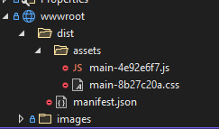

_Updated 17 apr 2023: Libraries in example code updated to latest stable versions (.NET 6 LTS, Vite 4) and simplified vite config file._

**TLDR;**

Vite is a new build tool for client-side JavaScript and Css. It replaces webpack, but is much faster and easier to configure. With the Microsoft.AspNetCore.SpaServices.Extensions package, it can be integrated nicely in ASP.NET Core web applications. An example application that demonstrates all this can be found at [https://github.com/martijnboland/LeanAspNetCore-React](https://github.com/martijnboland/LeanAspNetCore-React "https://github.com/martijnboland/LeanAspNetCore-React").

### Where do we come from?

In the past years, I’ve been using [ASP.NET Core SpaServices](https://docs.microsoft.com/en-us/aspnet/core/client-side/spa-services) together with [webpack](https://webpack.js.org/) to build full-stack web applications with relatively light-weight tooling. I’ve written about it back then in [this](https://blogs.taiga.nl/martijn/2018/06/14/lean-asp-net-core-2-1-manually-setup-a-razor-pages-project-with-bootstrap-npm-and-webpack/) [blog](https://blogs.taiga.nl/martijn/2018/06/22/lean-asp-net-core-2-1-add-a-react-application-to-an-existing-razor-pages-application/) [series](https://blogs.taiga.nl/martijn/2018/08/13/lean-asp-net-core-2-1-react-forms-validation-and-web-api-integration/).

However, it’s 2021 and things have moved on: [SpaServices is deprecated](https://blogs.taiga.nl/martijn/2019/10/11/goodbye-spaservices-it-was-fun-while-it-lasted/) and new client side build tools such as [Vite](https://vitejs.dev/) and [Snowpack](https://www.snowpack.dev/) have entered the stage. These new tools leverage the ability of modern browsers to natively load ES modules to get rid of the time-consuming bundling that is required at development time with webpack. Time to upgrade our tooling!

### Introducing Vite

[](https://blogs.taiga.nl/martijn/wp-content/uploads/2021/02/77ripvyhwi6xl0gqkvj9.png)

From the web site [https://vitejs.dev](https://vitejs.dev):

> Vite (French word for "fast", pronounced `/vit/`) is a build tool that aims to provide a faster and leaner development experience for modern web projects. It consists of two major parts:
> 
> - A dev server that provides [rich feature enhancements](https://vitejs.dev/guide/features.html) over [native ES modules](https://developer.mozilla.org/en-US/docs/Web/JavaScript/Guide/Modules), for example extremely fast [Hot Module Replacement (HMR)](https://vitejs.dev/guide/features.html#hot-module-replacement).
> - A build command that bundles your code with [Rollup](https://rollupjs.org/), pre-configured to output highly optimized static assets for production.

In our client-side toolchain, **Vite replaces webpack**. The main reason we picked Vite over  the alternatives is that Vite comes with batteries included. It can do [everything we need](https://vitejs.dev/guide/features.html) and comes with very sensible defaults while other solutions require a bit more configuration.

Since [Vite 2.0 was released](https://dev.to/yyx990803/announcing-vite-2-0-2f0a) (which was a huge step forward from version 1), it’s completely framework-agnostic and super-flexible due to its plugin architecture (but without the configuration hell that sometimes comes with comparable flexible tooling).

Oh and Vite is **fast**. Really **fast!**

### Setup client-side build with Vite

In ASP.NET Core projects it’s pretty common to have a ClientApp folder where all client-side code is located. This is where we put our package.json en vite.config.ts to setup the build configuration. Vite comes with [TypeScript support](https://vitejs.dev/guide/features.html#typescript) out of the box, so let’s use that as well.

Install vite and typescript:

```
npm install vite typescript –save-dev
```

The example vite.config.ts file below is enough configuration to get started:

```
[sourcecode language='javascript'  padlinenumbers='true']
import { defineConfig } from 'vite'

export default defineConfig({
  base: '/dist/'
})
[/sourcecode]

```

It says: the base folder for the client-side files is /dist/ (we need this to reference the files from the ASP.NET Core Razor views).

Compare that with the length of your average webpack configuration file!

You can start the Vite dev server from the command line in the ClientApp folder with:

```
npx vite
```

but it’s convenient to define a few npm script tasks in the package.json file:

```
[sourcecode language='javascript'  padlinenumbers='true']
"scripts": {
    "start": "echo Starting the development server && vite",
    "dev": "vite",
    "build": "vite build"
}
[/sourcecode]

```

This way we can execute Vite in the following ways:

- **npm run dev** - start the Vite development server;
- **npm run build** – create a production bundle
- **npm start** – display a ‘Starting.. ‘ message and start the Vite development server.

So what about this last command? Why display a message in the console before doing the same as we were already doing?  Stay tuned…

### Integrate client-side build with ASP.NET Core

In ASP.NET Core for .NET 5 and up, we can use the package [Microsoft.AspNetCore.SpaServices.Extensions](https://www.nuget.org/packages/Microsoft.AspNetCore.SpaServices.Extensions) to integrate client-side build tooling with our ASP.NET Core application. This package was originally designed to support Angular and React CLI projects in Visual Studio templates, but in reality, we can use it for all client-side build tooling that is started with a npm run … script.

In our Startup.cs we add the following code in the Configure method:

```
[sourcecode language='csharp'  padlinenumbers='true']
using Microsoft.AspNetCore.SpaServices.ReactDevelopmentServer;
...

    public class Startup
    {
		...

        public void Configure(IApplicationBuilder app, IWebHostEnvironment env)
        {
			 ...

            if (env.IsDevelopment())
            {
                app.UseSpa(spa =>
                {
                    spa.Options.SourcePath = "ClientApp";
                    spa.Options.DevServerPort = 5173;

                    spa.UseReactDevelopmentServer(npmScript: "start");
                });
            }
        }
    }

[/sourcecode]

```

The UseSpa middleware handles requests for client scripts and forwards these to the running Vite development server on port 5173. Starting the Vite development server is done by abusing the spa.UseReactDevelopmentServer method which in fact has nothing to do with React but just executes an npm script in the context of the ASP.NET Core process. However, UseReactDevelopmentServer only works properly when the npm script outputs the line ‘Starting the development server’. For that reason we have to create that special npm start script in package.json that first echos the ‘Starting the development server’ line to keep the middleware happy and then proceeds with starting the Vite development server.

The final step is to reference the scripts that are served by the Vite development server from the Razor layout:

```
[sourcecode language='html' ]

    
    

[/sourcecode]

```

First, we have to add a reference to the Vite runtime script that facilitates development features like hot-reloading (escaping the Razor-reserved @ with @@) and then reference the entrypoint script file(s). Two things are important here:

- The type=”module” attribute _must_ be added to the script tags to enable the native import features of modern browsers;
- The script path in the src attribute has to start with the base property that we defined in our vite.config.ts, in our case “/dist/”.

When the browser requests the entrypoint script file, the request is handled by the UseSpa middleware en forwarded to the Vite development server.

### Building for production

So far we have only been talking about building for the development environment but what about building for production?

Vite covers this by using Rollup for creating the production bundles. This requires a bit extra configuration in the vite.config.ts file:

```
[sourcecode language='javascript' ]
import { defineConfig } from 'vite'

export default defineConfig({
  base: '/dist/',
  build: {
    outDir: '../wwwroot/dist',
    emptyOutDir: true,
    manifest: true,
    rollupOptions: {
      input: {
        main: './js/main.js',
      }
    }
  }
})
[/sourcecode]

```

In the ‘build’ property we tell Vite that production bundles must go into the ‘../wwwroot/dist’ folder and the ‘./js/main.js’ is the ‘main’ entrypoint. Running ‘npm run build’ in the ClientApp folder results in the following build output:

[](https://blogs.taiga.nl/martijn/wp-content/uploads/2023/04/vite-output.png)

As you can see, the generated bundles are suffixed with a hash for cache busting, so we cannot directly reference those in our Razor layout file. The [Vite documentation](https://vitejs.dev/guide/backend-integration.html) suggests to use the manifest.json file on the backend to resolve the correct references, but luckily we can use a shortcut with the [asp-src-include](https://docs.microsoft.com/en-us/dotnet/api/microsoft.aspnetcore.mvc.taghelpers.scripttaghelper.srcinclude?view=aspnetcore-5.0#Microsoft_AspNetCore_Mvc_TagHelpers_ScriptTagHelper_SrcInclude) tag helper:

```
[sourcecode language='html' ]

    

[/sourcecode]

```

This tag helper allows wild cards in the script name, so we can reference the generated script file by using a wild card for the hash.

The same goes for referencing the generated css bundle in the head of the Razor layout:

```
[sourcecode language='html' ]

    

[/sourcecode]

```

Here we use the asp-href-include tag helper to reference the generated css bundle.

### A complete example

The LeanAspNetCore-React application that I used as an example in my old blog posts is now rewritten to use Vite and Microsoft.AspNetCore.SpaServices.Extensions. It serves as an example for a multi-page web application that contains both ‘old’ technologies as well as a small React application.

Check it out at [https://github.com/martijnboland/LeanAspNetCore-React](https://github.com/martijnboland/LeanAspNetCore-React "https://github.com/martijnboland/LeanAspNetCore-React").

### Conclusion

I think integrating Vite with ASP.NET Core is a winning solution for full-stack ASP.NET Core developers that  want to leverage the best client-side tooling that is available at this moment. The main drawbacks of earlier solutions that uses SpaServices and webpack, performance and complex configuration, are no longer an issue. Happy days!
