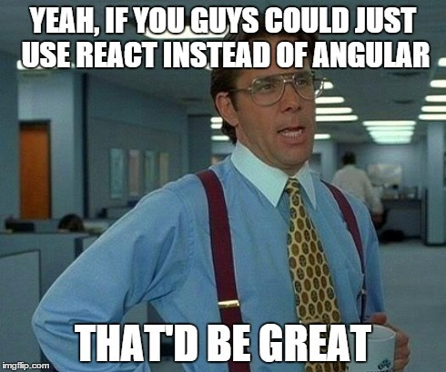

The last couple of years, many .NET developers are making a gradual shift from developing  Windows and/or server-side ASP.NET applications to client-side JavaScript apps, myself included. That is not really specific for .NET developers, it happens elsewhere too. What _is_ specific, are the tools and frameworks that .NET developers tend to use to build these JavaScript apps. I’m suspecting that the vast majority of the .NET community went through the following stages:

- 2005-2007: **ASP.NET AJAX** This new ‘AJAX’ thing is all the rage, but we really don’t want to write JavaScript. Love those UpdatePanels!
- 2007-2011: **jQuery** We still don’t want to write JavaScript, but ASP.NET AJAX is way too clunky and [jQuery](http://jquery.com) is supported by Microsoft, so hey, it must be good!
- 2011-2012: **KnockoutJS** jQuery spaghetti becomes unmanageable but luckily, Steve Sanderson ports the MVVM concept from WPF and Silverlight and we can build proper client-side apps. At one time, [KnockoutJS](http://knockoutjs.com/) was even part of standard Visual Studio templates
- 2012-2013: **Durandal** Based on KnockoutJS and RequireJS, Rob Eisenberg (of Caliburn fame) creates [Durandal](http://durandaljs.com/), which is a complete framework. Now we have a one-stop shop for all our needs. No hassle with 3rd party libs for routing etc. anymore.
- 2014: **AngularJS** Some influential .NET people have discovered [Angular](https://angularjs.org/). Two-way binding without those pesky observables and it’s backed by a real big company. Hurray! Even Durandal creator Rob Eisenberg joins the Angular team, so that must really be the best thing since bread came sliced.
- 2015: **Unkown** _Wait, whut?!_ In october 2014, AngularJS 2.0 was announced as a being non-compatible with the current 1.x version and a month later, Rob Eisenberg announced that he’s left the Angular team. BOOM!!! Suddenly, AngularJS [wasn’t the coolest kid in town anymore](../angular-is-the-new-uncool/) and the .NET/JavaScript community is kind of left in the dark where to go now.

### The Framework Vacuum

After the Angular 2.0 announcement, some of us went desperately looking for alternatives like [React](http://facebook.github.io/react/), [Ember](http://emberjs.com/) or even [VanillaJS](http://vanilla-js.com/), some went back to their trusty Durandal or Knockout codebases and wait for [Aurelia](http://aurelia.io/) to mature and perhaps most of us just continued on the Angular 1.x stack. But there is no clear leading framework or library anymore.

And that is good.

Not having a dominant framework or library or whatever, forces us developers to think about what we really _need_ instead of the [cargo cult](http://en.wikipedia.org/wiki/Cargo_cult_programming) mentality that has been so prevalent the last  years. Take the time to do a proper analysis of the problem you need to solve.

And that is good too.

When starting a new project, just pick the framework that is the best fit for the project _at that time,_ taking into account the particular skills and knowledge of your co-workers. It’s impossible to predict which one will survive the next years. Just don’t go all in with a single framework. Keep your options open. Also keep considering full server-side apps. They’re terribly out of fashion but unbeatable for some scenarios.

Some people advocate the use of no framework at all, but only use small, very focused libraries ([microjs](http://microjs.com/)) or write everything yourself. Personally, I think that only a very, very skilled team can get away with this because you’ll end up building a framework anyway.

### Meanwhile today

Having some kind of framework vacuum these days gives us a nice opportunity to focus on other important aspects of modern day JavaScript development.

#### Javascript build tools

Invaluable. Automate everything from building and minifying JavaScript to deployment and everything in between. You could use ASP.NET bundling for this, but in my experience, dedicated build tools are much more powerful and flexible.

[Grunt](http://gruntjs.com/) and [Gulp](http://gulpjs.com/) are the main players. Grunt is widely used, has a huge amount of plugins but isn’t really fast and can be somewhat complex to configure, Gulp is faster and requires less configuration than Grunt and is generally preferred these days.

[WebPack](http://webpack.github.io/) might be an interesting alternative. It’s not a general purpose build system, but focuses on bundling. A unique feature of WebPack is that it can bundle all parts of your application into a single bundle, including images and stylesheets.

#### Javascript modules

You should really put your JavaScript code in modules. It allows for better encapsulation, modularity and prevents polluting the global scope (the window object in browsers). There are multiple ways to define modules in JavaScript: [AMD with RequireJS](http://requirejs.org/docs/whyamd.html) and [CommonJS with Browserify](http://browserify.org/) are widely used, but with ECMAScript 6, [native modules](http://www.2ality.com/2014/09/es6-modules-final.html) are coming as well. AMD allows for dynamic module loading in the browser where CommonJS/Browserify always requires a build step. On the other hand, I personally find the AMD module syntax intrusive, RequireJS requires way too much configuration and a build step is required for your production builds anyway. I’d say use CommonJS/Browserify for the time being and reconsider when ES6 is ready.

#### Javascript package managers

Still using [NuGet](http://www.nuget.org/) to pull in JavaScript libraries and frameworks? Please don’t. Use [Bower](http://bower.io/), [NPM](https://www.npmjs.com/) or [JSPM](http://jspm.io/) (can use Bower as well as NPM). All major JavaScript libraries are being released for Bower and NPM where NuGet comes as an afterthought (if at all).

#### ECMAScript 6 (ES6)

ECMAScript 6 is the next incarnation of the JavaScript language. Although native browser support is not there yet, there are so [many interesting features](https://github.com/lukehoban/es6features) that you might consider using it today. Transpilers like [Babel](https://babeljs.io/) or [Traceur](https://github.com/google/traceur-compiler) can turn your ES6 code into ES5 code that runs in all modern browsers. With the JavaScript build systems it’s super easy to add a transpile step so there are no real obstacles.

### Visual Studio 2015

While it can be refreshing to step out of our trusty Visual Studio Environment, it’s good to know that Visual Studio 2015 will get support for Gulp, Grunt, Bower and NPM.
