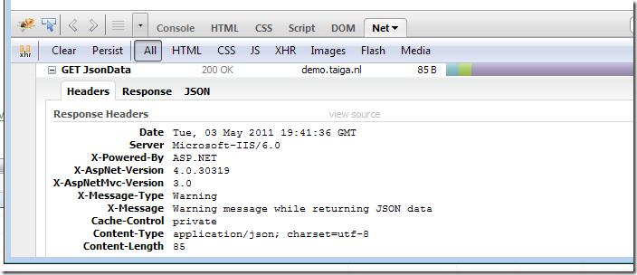

In almost every application, feedback from the application to the user via notification messages is required.


For some strange reason, we don’t have a standard way in .NET web applications for dealing with this kind of messages and I find myself hacking some half-baked solutions over and over again. Starting from today, this must end! In this post we’re going to find a solution for ASP.NET MVC 3.

### One single way to display messages

This is the one and only requirement:

> In every scenario I want to be able to call ShowMessage() from my controller action and the message appears on the screen.

### ShowMessage extension method

To have a ShowMessage method in every controller action, we could implement it in a base controller class or create an extension method. Let’s try an extension method:

```
public static void ShowMessage(this Controller controller, MessageType messageType, string message, bool showAfterRedirect = false)
{
    var messageTypeKey = messageType.ToString();
    if (showAfterRedirect)
    {
        controller.TempData[messageTypeKey] = message;
    }
    else
    {
        controller.ViewData[messageTypeKey] = message;
    }
}
```

All this method does is take a message type enum (Success, Warning or Error) and a message and store it in either ViewData or TempData, depending on the flag ‘showAfterRedirect’. TempData is for [Post-Redirect-Get](http://en.wikipedia.org/wiki/Post/Redirect/Get) situations.

  
We can now call ShowMessage(). With this solution it’s only possible to store one type of message per request, but that should be enough (even more than one message is already troublesome).

### RenderMessages HTML Helper

Creating messages is one thing, but what about displaying them? It’s also easy. Enter the RenderMessages() HTML helper:

```
/// <summary>
/// Render all messages that have been set during execution of the controller action.
/// </summary>
/// <param name="htmlHelper"></param>
/// <returns></returns>
public static HtmlString RenderMessages(this HtmlHelper htmlHelper)
{
    var messages = String.Empty;
    foreach (var messageType in Enum.GetNames(typeof(MessageType)))
    {
        var message = htmlHelper.ViewContext.ViewData.ContainsKey(messageType)
                        ? htmlHelper.ViewContext.ViewData[messageType]
                        : htmlHelper.ViewContext.TempData.ContainsKey(messageType)
                            ? htmlHelper.ViewContext.TempData[messageType]
                            : null;
        if (message != null)
        {
            var messageBoxBuilder = new TagBuilder("div");
            messageBoxBuilder.AddCssClass(String.Format("messagebox {0}", messageType.ToLowerInvariant()));
            messageBoxBuilder.SetInnerText(message.ToString());
            messages += messageBoxBuilder.ToString();
        }
    }
    return MvcHtmlString.Create(messages);
}
```

It iterates through all possible message types, tries to find a message in either ViewData or TempData and creates a div with the message in it.  
Put the helper in the Layout page, add some css classes (.messagebox, .succes, .warning and .error) and we’re all set.

### What about AJAX?

Now this is getting tricky. In our AJAX actions, we can still call ShowMessage(), but how should the message be displayed if we only return some JSON data or a partial view? One solution would be to wrap all AJAX results in a special JSON view result with the notification messages and the original result embedded. Drawback is that we have quite some work to do on the client-side to handle all this.

### HTTP headers to the rescue

I discovered a very nice solution on StackOverflow: [use custom HTTP headers to store a message](http://stackoverflow.com/questions/366311/how-do-you-handle-rails-flash-with-ajax-requests). With the help of a global action filter we can check if there are messages in the ViewData dictionary and when the request was an AJAX request, copy the messages to a custom HTTP header.

```
/// <summary>
/// If we're dealing with ajax requests, any message that is in the view data goes to
/// the http header.
/// </summary>
public class AjaxMessagesFilter : ActionFilterAttribute
{
    public override void OnActionExecuted(ActionExecutedContext filterContext)
    {
        if (filterContext.HttpContext.Request.IsAjaxRequest())
        {
            var viewData = filterContext.Controller.ViewData;
            var response = filterContext.HttpContext.Response;

            foreach (var messageType in Enum.GetNames(typeof(MessageType)))
            {
                var message = viewData.ContainsKey(messageType)
                                ? viewData[messageType]
                                : null;
                if (message != null) // We store only one message in the http header. First message that comes wins.
                {
                    response.AddHeader("X-Message-Type", messageType);
                    response.AddHeader("X-Message", message.ToString());
                    return;
                }
            }
        }
    }
}
```



Finally the message in the HTTP headers are displayed with a little bit of jQuery:

```
$(document).ready(function () {
    handleAjaxMessages();
});

function handleAjaxMessages() {
    $(document).ajaxSuccess(function (event, request) {
        checkAndHandleMessageFromHeader(request);
    }).ajaxError(function (event, request) {
        displayMessage(request.responseText, "error");
    });
}

function checkAndHandleMessageFromHeader(request) {
    var msg = request.getResponseHeader('X-Message');
    if (msg) {
        displayMessage(msg, request.getResponseHeader('X-Message-Type'));
    }
}

function displayMessage(message, messageType) {
    $("#messagewrapper").html('<div class="messagebox ' + messageType.toLowerCase() + '"></div>');
    $("#messagewrapper .messagebox").text(message);
}
```

### Demo

For a closer look [check out the live demo](http://demo.taiga.nl/notification/) or download the VS2010 solution from [GitHub](https://github.com/martijnboland/MvcNotification).
