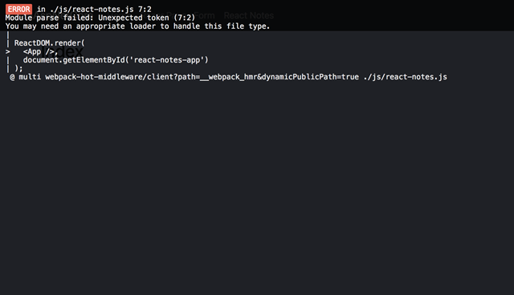
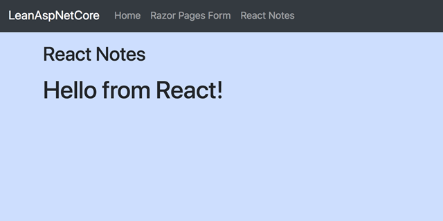

_This post is part of a multi-post series:_

1. _[Lean ASP.NET Core 2.1 – manually setup a Razor Pages project with Bootstrap, NPM and webpack](../lean-asp-net-core-2-1-manually-setup-a-razor-pages-project-with-bootstrap-npm-and-webpack/)_
2. _Lean ASP.NET Core 2.1 – add a React application to an existing Razor Pages application (this post)_
3. [_Lean ASP NET Core 2.1 – React forms, validation and Web API integration_](../lean-asp-net-core-2-1-react-forms-validation-and-web-api-integration/)

[](https://reactjs.org/)In the [previous post](../lean-asp-net-core-2-1-manually-setup-a-razor-pages-project-with-bootstrap-npm-and-webpack/), I showed how to manually build a simple, lean, ASP.NET Core 2.1 Razor Pages application that uses [webpack](http://webpack.js.org) to bundle client scripts and css styles. As promised, in this post, we’ll add a very small [React](https://reactjs.org/) JavaScript app to the already [existing Razor Pages application](https://github.com/martijnboland/LeanAspNetCore). Again, for the impatient, the source code for this post can be found at  [https://github.com/martijnboland/LeanAspNetCore-React](https://github.com/martijnboland/LeanAspNetCore-React "https://github.com/martijnboland/LeanAspNetCore-React").

### Adding React, but how?

For new React applications, [create-react-app](https://github.com/facebook/create-react-app) is the way to go. It will conveniently generate much of the required build infrastructure (such as the webpack configuration and a development server). However, we already have our build infrastructure in place, so in our scenario it’s easier to just add some libraries and extend the webpack configuration manually. Plus, and that’s a _big_ plus in my opinion, we’re still totally flexible and in charge.

### Let’s do it!

Before adding the React app, we first have to re-organize our existing application a little bit. The webpack configuration from our [previous post](../lean-asp-net-core-2-1-manually-setup-a-razor-pages-project-with-bootstrap-npm-and-webpack/) creates a single JavaScript bundle that also includes jQuery and the Bootstrap JavaScript where we only need the Bootstrap css (and React, of course) for our React app. So, we split our bundles into a main bundle that is used in all pages and a bundle for the jQuery-Bootstrap scripts that is only used by the ‘classic’ server-side pages. This can be done by adding a new ‘classic\_jquery’ entry in webpack.config.js:

```
entry: {
  main: './js/main.js',
  classic_jquery: './js/classic-jquery.js'
}, 

```

main.js is reduced to:

```
import '../styles/style.css';

```

and classic-jquery.js contains:

```
import $ from 'jquery';

import 'popper.js';
import 'bootstrap';

import 'jquery-validation';
import 'jquery-validation-unobtrusive';

$.validator.setDefaults({
  highlight: function (element) {
    $(element).addClass("is-invalid");
  },
  unhighlight: function (element) {
    $(element).removeClass("is-invalid");
  }
});


```

Normally, the new bundle would also be referenced from the Pages/Shared/\_Layout.cshtml layout page but in our case, we don’t want it in every page. This is solved by creating a new nested layout page (/Pages/Shared/\_Classic\_Layout.cshtml):

```
@{
    Layout = "_Layout";
}

@RenderBody()

@section scripts 
{
    <environment names="Development">
        <script src="~/dist/classic_jquery.js"></script>
    </environment>
    <environment names="Staging,Production">
        <script src="~/dist/classic_jquery.js" asp-append-version="true"></script>
    </environment>

    @RenderSection("scripts", required: false)
}

```

Also, the master layout page (/Pages/Shared/\_Layout.cshtml) must get a scripts section just before the </body> tag:

```
@RenderSection("scripts", required: false)

```

We set this nested layout page as the default in \_ViewStart.cshtml so all Razor pages reference the main.js _and_ classic\_jquery.js bundles but it’s also possible to only reference the main.js bundle by manually setting \_Layout.cshtml as the layout for the page.

### Manually adding the React app

The React app we’re adding will become an app for taking notes. However, in this post we stick to a simple ‘Hello world’. The actual notes app is for the next post in this series.

1. Add a new Razor page that will host the React app (/Pages/ReactNotes.cshtml):
    
    ```
    @page
    @{
        Layout = "Shared/_Layout.cshtml";
        ViewData["Title"] = "React Notes";
    }
    
    <div id="react-notes-app"></div>
    
    @section scripts
    {
        <environment names="Development">
            <script src="~/dist/react_notes.js"></script>
        </environment>
        <environment names="Staging,Production">
            <script src="~/dist/react_notes.js" asp-append-version="true"></script>
        </environment>
    }
    
    ```
    
    As you can see, we override the default layout page and use the master layout page (that does not reference classic\_jquery.js), but we add a reference to a new bundle, ‘react\_notes.js’. This bundle will contain our complete React app that will be injected into the ‘react-notes-app’ div element.
2. Add a link to the the React Notes page in the header (/Pages/Shared/\_Header.cshtml)
    
    ```
    <li class="nav-item">
      <a class="nav-link" asp-page="ReactNotes">React Notes</a>
    </li>
    
    ```
    
3. From the command-line prompt, go to the /ClientApp folder and install React:
    
    ```
    npm install react react-dom --save
    ```
    
4. Add the React JavaScript app code. It consists of the entry point, /ClientApp/js/react-notes.js:
    
    ```
    import React from 'react';
    import ReactDOM from 'react-dom';
    
    import App from './react-notes/App';
    
    ReactDOM.render(
      <App />,
      document.getElementById('react-notes-app')
    );
    
    ```
    
    and the root App component, /ClientApp/js/react-notes/App.js
    
    ```
    import React from 'react';
    
    const App = () => {
      return (
        <h1>Hello from React!</h1>
      );
    };
    
    export default App;
    
    ```
    
5. Register the React app entry point in /ClientApp/webpack.config.js. This should create the react\_nodes.js bundle that is referenced from the ReactNotes.cshtml Razor page:
    
    ```
    entry: {
      main: './js/main.js',
      classic_jquery: './js/classic-jquery.js',
      react_notes: './js/react-notes.js'
    },
    
    ```
    
    Let's see if it's working. Navigate to the project root folder in the command line, enter
    
    ```
    dotnet run
    ```
    
    and navigate to [https://localhost:5001/ReactNotes](https://localhost:5001/ReactNotes) 
    
    Whoops, looks like something is missing. Webpack has an issue with the <App /> component, which is totally understandable because that is the React-specific [JSX](http://buildwithreact.com/tutorial/jsx) syntax and we haven’t done anything yet to let webpack know how to handle that.

### And now?

Most tutorials suggest to use [Babel](https://babeljs.io/) and the [babel-loader](https://github.com/babel/babel-loader) for webpack, for example [this one](https://www.valentinog.com/blog/react-webpack-babel/), but the great thing is that the [TypeScript](https://www.typescriptlang.org/) compiler also [understands the React JSX syntax](https://www.typescriptlang.org/docs/handbook/jsx.html). Personally, I think TypeScript in combination with React simply works brilliantly. For example, it’s not unusual to mistype a property name of a React component, resulting in a debugging session. By typing your props, the compiler finds all typos and when using an editor like Visual Studio Code, you even get intellisense for you React components.

### Adding TypeScript

1. Add TypeScript, a TypeScript loader for webpack and the React TypeScript type definitions. We’re using the [awesome-typescript-loader](https://github.com/s-panferov/awesome-typescript-loader) for webpack because the other common option, [ts-loader](https://github.com/TypeStrong/ts-loader), had an issue with TypeScript 2.9.2 at the time of writing. In the /ClientApp folder run:
    
    ```
    npm install typescript awesome-typescript-loader @types/react @types/react-dom --save-dev
    ```
    
2. Add a tsconfig.json file to the /ClientApp folder:
    
    ```
    {
      "compilerOptions": {
        "outDir": "../wwwroot/dist/",
        "noImplicitAny": true,
        "module": "es6",
        "target": "es5",
        "jsx": "react",
        "moduleResolution": "node",
        "sourceMap": true
      }
    }
    
    ```
    
    This are settings for the TypeScript compiler. Most notable is the “jsx” setting. This is set to “react”, which means that all JSX is converted to React.createElement() function calls. Also, we’re creating source maps to enable proper debugging of the .tsx files.
3. Change the extension of our React files to .tsx (/ClientApp/js/react-notes.js and /ClientApp/js/react-notes/App.js). The TypeScript compiler only understands JSX syntax in .tsx files.
4. Change the imports of react and react-dom in the .tsx file from
    
    ```
    import React from ‘react’
    ```
    
    to
    
    ```
    import * as React from ‘react’
    ```
    
    because react and react-dom have no default exports and TypeScript doesn’t like that
5. Change the webpack configuration file (/ClientApp/webpack.config.js):
    
    ```
    const path = require('path');
    const MiniCssExtractPlugin = require('mini-css-extract-plugin');
    
    module.exports = (env = {}, argv = {}) => {
      
      const isProd = argv.mode === 'production';
    
      const config = {
        mode: argv.mode || 'development', // we default to development when no 'mode' arg is passed
        entry: {
          main: './js/main.js',
          classic_jquery: './js/classic-jquery.js',
          react_notes: './js/react-notes.tsx'
        }, 
        output: {
          filename: '[name].js',
          path: path.resolve(__dirname, '../wwwroot/dist'),
          publicPath: "/dist/"
        },
        resolve: {
          // Add `.ts` and `.tsx` as a resolvable extension.
          extensions: [".ts", ".tsx", ".js"]
        },
        plugins: [
          new MiniCssExtractPlugin({
            filename: 'styles.css'
          })
        ],
        module:  {
          rules: [
            {
              test: /\.css$/,
              use: [
                isProd ?  MiniCssExtractPlugin.loader : 'style-loader', 
                'css-loader' 
              ]
            },
            {
              test: /\.tsx?$/,
              use: 'awesome-typescript-loader',
              exclude: /node_modules/
            }
          ]
        }
      }
      
      if (! isProd) {
        config.devtool = 'eval-source-map';
      }
    
      return config;
    };
    
    ```
    
    To make TypeScript work we have made the following changes to the configuration file:
    - Changed the react\_notes entry to ./js/react-notes.tsx ;
    - Added a 'resolve' section so that webpack also includes .ts and .tsx files when trying to resolve imports;
    - Added a loader rule for .ts and .tsx files (/\\.tsx?$/) so that awesome-typescript-loader converts these files to JavaScript before webpack includes these in the bundle(s);
    - For development (non-production) environments, the devtool is explicitly set to 'eval-source-map' because the webpack default setting for development is 'eval' and that only shows the compiled sources which makes debugging very hard.

That should do it! From the command-line, go to the project root folder and execute:

```
dotnet run
```

Navigating to [https://localhost:5001/ReactNotes](https://localhost:5001/ReactNotes "https://localhost:5001/ReactNotes") should now result in:



Again, the code for this post is at GitHub: [https://github.com/martijnboland/LeanAspNetCore-React](https://github.com/martijnboland/LeanAspNetCore-React "https://github.com/martijnboland/LeanAspNetCore-React"). This is now an application that supports both ‘classic’ server-side development but also ‘modern’ client-side development with React.

In the next post, we’ll finish the React notes app and integrate it with a small ASP.NET Core server API.
