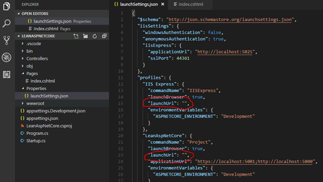
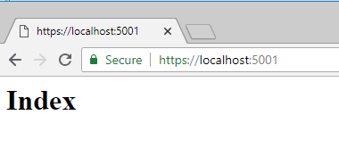
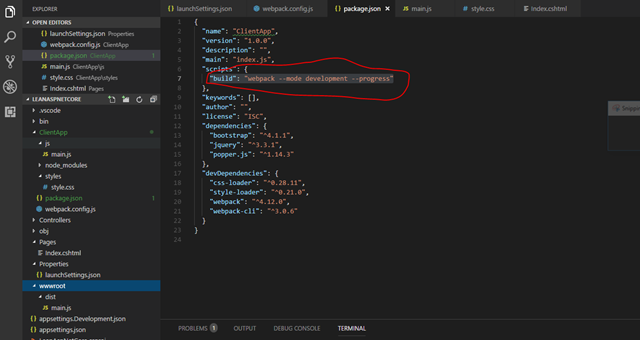
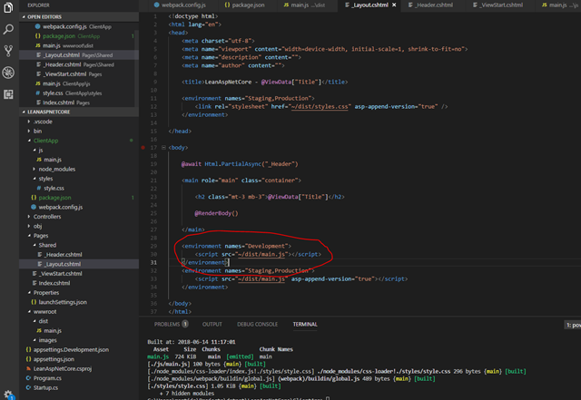
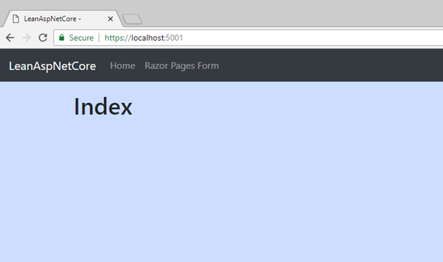

_This post is part of a multi-post series:_

1. _Lean ASP.NET Core 2.1 – manually setup a Razor Pages project with Bootstrap, NPM and webpack (this post)_
2. [_Lean ASP.NET Core 2.1 – add a React application to an existing Razor Pages application_](https://blogs.taiga.nl/martijn/2018/06/22/lean-asp-net-core-2-1-add-a-react-application-to-an-existing-razor-pages-application/)
3. [_Lean ASP NET Core 2.1 – React forms, validation and Web API integration_](https://blogs.taiga.nl/martijn/2018/08/13/lean-asp-net-core-2-1-react-forms-validation-and-web-api-integration/)

[](https://asp.net)

In the past, I have written about setting up a minimal ASP.NET Core MVC application with NPM and webpack ([ASP.NET Core 1.1 version](https://blogs.taiga.nl/martijn/2017/08/02/building-the-minimal-asp-net-core-app-with-webpack-and-npm/), [ASP.NET Core 2.0 version](https://blogs.taiga.nl/martijn/2017/11/24/building-and-asp-net-core-mvc-app-with-npm-and-webpack-asp-net-core-2-0-edition/)). These posts were mainly inspired by some unfortunate choices that had been made in the default Visual Studio project templates.

I tried to show an alternative way to manually setup an ASP.NET MVC project and use ‘modern’ commonly-used  tools like [webpack](https://webpack.js.org/) and [NPM](https://www.npmjs.com/) to create a simple ASP.NET MVC application with [jQuery](https://jquery.com/) and [Bootstrap](https://getbootstrap.com/) for some client-side juice.

#### But isn’t this modern web development where everything changes all the time?

[](https://webpack.js.org)Yes :-). Fast-forward a few months and we’re in quite a different situation:

- ASP.NET Core 2.1 has been released with a lot of improvements and new features (for example, [Razor Pages](https://docs.microsoft.com/en-us/aspnet/core/mvc/razor-pages/?view=aspnetcore-2.1&tabs=visual-studio));
- The ASP.NET Core templates are improved significantly. Gone are Bower and things like bundleconfig.json. The simple templates just include the actual .js and .css files without requiring a package manager and the more complex SPA templates (angular, react) use NPM and webpack;
- Webpack 4 is released with more carefully chosen default settings, so less configuration is required;

#### So ditch the manual setup and pick a template?

Yes and no. In more situations than before, the default templates will now probably suffice, but on the other hand, I feel there’s something missing between the simple templates and the complex SPA templates.

[](https://www.npmjs.com/)Often, I want to start with a clean simple template _but_ I also want to use NPM and webpack. There’s no template that covers this middle ground and the SPA templates are a bit overkill when you don’t have a SPA.

However, in this post I’ll show how easy it is to cover this middle ground with a manual setup. Starting with a simple template and manually add everything else step by step. I’m calling this a ‘lean’ application because we’re only adding the minimal required parts, but with keeping all options open for future extensions.

#### Building a ‘lean’ ASP.NET Core 2.1 application

Just like in the [previous](https://blogs.taiga.nl/martijn/2017/08/02/building-the-minimal-asp-net-core-app-with-webpack-and-npm/) [posts](https://blogs.taiga.nl/martijn/2017/11/24/building-and-asp-net-core-mvc-app-with-npm-and-webpack-asp-net-core-2-0-edition/), we’re building a basic ASP.NET Core app with a home page  that is styled with Bootstrap from NPM, built with webpack and can be deployed to production environments. For the impatient: get the source code at [https://github.com/martijnboland/LeanAspNetCore](https://github.com/martijnboland/LeanAspNetCore "https://github.com/martijnboland/LeanAspNetCore") ;-).

Prerequisites:

- .NET Core 2.1 SDK
- Node.JS 6.9.0 or higher
- Your favorite code editor, Visual Studio is not required but can also be used
- Some basic knowledge about ASP.NET, Razor, JavaScript

Since ‘_lean’_ is our objective we’re keeping it simple and don’t use our heavyweight friend Visual Studio but stick to the command line and a text editor. Everything works fine on Mac OS too.

#### First steps

1. Create a new empty ASP.NET Core project based on the webapi template. This project template serves as a nice clean starting point that has appSettings.json etc. setup but not too much garbage that needs to be deleted anyway:
    
    ```
    mkdir LeanAspNetCore
    cd LeanAspNetCore
    dotnet new webapi
    ```
    
2. Create a Pages folder in the folder where new project is created. Add the first Razor Page, Index.cshtml to the Pages folder:
    
    ```
    @page
    <h1>Index</h1>
    
    ```
    
3. Locate the Properties/launchSettings.json file and set the values of both launchUrl attributes to "":
4. Run the application:
    
    ```
    dotnet run
    ```
    
5. Open your browser and browse to https://localhost:5001](https://localhost:5001). You should see the following:[

It works but it does look a bit basic don’t you think?

#### Styles, scripts and bundling

To make things look a bit less basic we’ll just add some Bootstrap styles. But also, it’s time to setup our client-side build infrastructure.

1. Create a ClientApp folder and install libraries there with NPM. The folder is named ClientApp simply because it’s called that way in the official SPA templates, so it will look already familiar for some of you.
    
    ```
    mkdir ClientApp
    cd ClientApp
    npm init -y
    npm install --save jquery popper.js bootstrap
    npm install --save-dev webpack webpack-cli style-loader css-loader
    
    ```
    
    With the above commands we created a package.json file, installed bootstrap with its dependencies (jquery and popper.js) and the build libraries (webpack with style and css loaders).
2. Add a css file in /ClientApp/styles/style.css. Here, we import the bootstrap css and add our own custom styles:
    
    ```
    @import '~bootstrap/dist/css/bootstrap.css';
    
    body {
      background-color: #cdf;
    }
    
    ```
    
    _Note: the ~ in the import indicates that webpack should look in the node\_modules folder._
3. Create an entry point for the client-side bundle. This is the JavaScript file that imports all dependencies. In our case it’s located in /ClientApp/js/main.js:
    
    ```
    import '../styles/style.css';
    
    import $ from 'jquery';
    
    import 'popper.js';
    import 'bootstrap';
    
    ```
    
    Note that the css file is also imported here.
4. Add a webpack configuration file (/ClientApp/webpack.config.js)
    
    ```
    const path = require('path');
    
    module.exports = (env = {}, argv = {}) => {
      
      const config = {
        mode: argv.mode || 'development', // we default to development when no 'mode' arg is passed
        entry: {
          main: './js/main.js'
        }, 
        output: {
          filename: '[name].js',
          path: path.resolve(__dirname, '../wwwroot/dist'),
          publicPath: "/dist/"
        },
        module:  {
          rules: [
            {
              test: /\.css$/,
              use: [
                'style-loader',
                'css-loader' 
              ]
            }
          ]
        }
      }
      
      return config;
    };
    
    ```
    
    See the [webpack documentation](https://webpack.js.org/configuration/) for the configuration options. The configuration file above means: 'start building from the ./js/main.js file, write the results in the ../wwwroot/dist folder and process css files via the css-loader and style-loader'.
    
    _Webpack 4 has a new parameter: 'mode'. The modes are 'development' and 'production' and webpack uses sensible default settings for the modes so you don't have to configure these yourself anymore. See [this post](https://medium.com/webpack/webpack-4-mode-and-optimization-5423a6bc597a) for more information._
5. Add a script command to package.json that executes the webpack build:
6. Build the client bundle (still from ClientApp folder):
    
    ```
    npm run build
    
    ```
    
    After building, there is a single file 'main.js' in the /wwwroot/dist folder.
7. All we need to do now is to create a Razor partial \_Header.cshtml file with a Bootstrap navigation bar and \_Layout.cshtml file that includes the header file and add  a script link to ~/dist/main.js:Noticed the environment tag helpers in the image above? We just include the main.js script file in the development environment but for the other environments, a version is appended to the file for cache busting. The layout file is set as the default layout for all pages via \_ViewStart.cshtml in the Pages folder. To enable the tag helpers we must add a \_ViewImports.cshtml file to the Pages folder:
    
    ```
    @namespace LeanAspNetCore.Pages
    @addTagHelper *, Microsoft.AspNetCore.Mvc.TagHelpers
    
    ```
    
    For more information about Razor layouts, \_ViewStart.cshtml and ViewImports.html, [visit this page](https://docs.microsoft.com/en-us/aspnet/core/mvc/views/layout?view=aspnetcore-2.1).
8. Add the StaticFiles middleware to Startup.cs just before app.UseMvc() so we can serve the js and other static files:
    
    ```
    app.UseStaticFiles();
    
    ```
    
9. Go to the project root folder in the command line and execute:
    
    ```
    dotnet run
    ```
    
    When browsing to https://localhost:5001 you should now see a nice styled page: 

That’s it! With a few steps we added Bootstrap from NPM and we’re able to include it in our application with the help of webpack.

#### Automate all the things

Having to execute ‘npm run build’ every time you want to see the results of a small change is getting tedious pretty fast . Luckily, ASP.NET Core already contains webpack development middleware (in Microsoft.AspNetCore.SpaServices.Webpack) that watches your client files and automatically rebuilds the bundle when a change happens. Change the Configure method in Startup.cs to:

```
public void Configure(IApplicationBuilder app, IHostingEnvironment env)
{
    if (env.IsDevelopment())
    {
        app.UseWebpackDevMiddleware(new WebpackDevMiddlewareOptions
        {
            ProjectPath = Path.Combine(Directory.GetCurrentDirectory(), "ClientApp"),
            HotModuleReplacement = true
        });
        app.UseDeveloperExceptionPage();
    }
    else
    {
        app.UseHsts();
    }

    app.UseHttpsRedirection();
    app.UseStaticFiles();
    app.UseMvc();
}

```

As you can see, even hot module replacement is supported so the browser automatically reloads changed parts of your bundle without having to to a complete refresh. To make this happen we also need to add a few client libraries as well. Go to the ClientApp folder and execute:

```
npm install --save-dev aspnet-webpack webpack-dev-middleware webpack-hot-middleware
```

Now, the development environment is setup for a nice development experience. Go to the project root folder and execute:

```
dotnet watch run
```

From now on, every time a file changes, either the server executable or the client bundle is rebuilt automatically. To see the effect, change the background color in ClientApp/styles/style.css, hit save and watch the browser.

#### Going live

One of the goals of this exercise is to create an optimized production-ready version of our application with a _single_ command: ‘dotnet publish’.

First however, we need to add a little bit extra webpack configuration to extract the css from the main.js bundle to its own file. With the css is in the main bundle, you might have noticed some flickering because the css is loaded _after_ the html and JavaScript (also because the script tag is at the bottom of the \_Layout.cshtml page). We use the webpack [MiniCssExtractPlugin](https://github.com/webpack-contrib/mini-css-extract-plugin) to create the separate css bundle (from the ClientApp folder):

```
npm install --save-dev mini-css-extract-plugin
```

Change webpack.config.js to:

```
const path = require('path');
const MiniCssExtractPlugin = require('mini-css-extract-plugin');

module.exports = (env = {}, argv = {}) => {
  
  const isProd = argv.mode === 'production';

  const config = {
    mode: argv.mode || 'development', // we default to development when no 'mode' arg is passed
    entry: {
      main: './js/main.js'
    }, 
    output: {
      filename: '[name].js',
      path: path.resolve(__dirname, '../wwwroot/dist'),
      publicPath: "/dist/"
    },
    plugins: [
      new MiniCssExtractPlugin({
        filename: 'styles.css'
      })
    ],
    module:  {
      rules: [
        {
          test: /\.css$/,
          use: [
            isProd ?  MiniCssExtractPlugin.loader : 'style-loader', 
            'css-loader' 
          ]
        }
      ]
    }
  }
  
  return config;
};

```

When the mode is 'production' (isProd), the MiniCssExtractPlugin loader is used instead of the style-loader that injects the css dynamically in the page. To load the extracted styles, a style tag is added to \_Layout.cshtml:

```
<environment names="Staging,Production">
    <link rel="stylesheet" href="~/dist/styles.css" asp-append-version="true" />
</environment>

```

Next, we need to add a ‘prod’  command to the scripts section in package.json to create a production bundle:

```
"scripts": {
  "build": "webpack --mode development --progress",
  "prod": "rimraf ../wwwroot/dist && webpack --mode production --progress"
}

```

The ‘rimraf’ (rm –rf) command is just to clean any build artifacts from earlier builds. We don’t want those in our production bundles. Install it with npm (ClientApp folder):

```
npm install --save-dev rimraf
```

Test if the production bundles are created by running:

```
npm run prod
```

You should now see a separate styles.css file in the wwwroot/dist folder and the total file size is much smaller than with a development build (npm run build).

How do we ensure that the production bundles are created when publishing the application? How can we hook into the publishing process? Edit the .csproj file in the project root folder:

```
<Project Sdk="Microsoft.NET.Sdk.Web">

  <PropertyGroup>
    <TargetFramework>netcoreapp2.1</TargetFramework>
    <ClientAppFolder>ClientApp</ClientAppFolder>
  </PropertyGroup>

  <ItemGroup>
    <Folder Include="wwwroot\dist\" />
  </ItemGroup>

  <ItemGroup>
    <PackageReference Include="Microsoft.AspNetCore.App" />
    <PackageReference Include="Microsoft.VisualStudio.Web.CodeGeneration.Design" Version="2.1.0" />
  </ItemGroup>

  <Target Name="EnsureNodeModules" BeforeTargets="Build" Condition=" '$(Configuration)' == 'Debug' And !Exists('$(ClientAppFolder)\node_modules') ">
    <Message Importance="high" Text="Restoring dependencies using 'npm'. This may take several minutes..." />
    <Exec WorkingDirectory="$(ClientAppFolder)" Command="npm install" />
  </Target>
  
  <Target Name="BuildClientAssets" AfterTargets="ComputeFilesToPublish">
    <Exec WorkingDirectory="$(ClientAppFolder)" Command="npm install" />
    <Exec WorkingDirectory="$(ClientAppFolder)" Command="npm run prod" />

    <!-- Include the newly-built files in the publish output -->
    <ItemGroup>
      <DistFiles Include="$(ClientAppFolder)\wwwroot\dist\**" />
      <ResolvedFileToPublish Include="@(DistFiles->'%(FullPath)')" Exclude="@(ResolvedFileToPublish)">
        <RelativePath>%(DistFiles.Identity)</RelativePath>
        <CopyToPublishDirectory>PreserveNewest</CopyToPublishDirectory>
      </ResolvedFileToPublish>
    </ItemGroup>

  </Target>

</Project>


```

A new target ‘BuildClientAssets’ is executed after ComputeFilesToPublish during the publishing process. Here we generate the client bundles by executing ‘npm run prod’. Also ‘npm install’ is called to ensure the libraries are installed. After generating the bundles, these are added to the files to publish. This step is copied directly from the ASP.NET SPA templates. Big thanks to the ASP.NET developers for figuring this out :-). Now publish:

```
dotnet publish
```

Navigate to the publish output folder (/bin/Debug/netcoreapp2.1/publish), run the published application with ‘dotnet LeanAspNetCore.dll’ (the application .dll file) and navigate to [https://localhost:5001](https://localhost:5001). You should see the same application as before, but now as an optimized version.


Have a look at the page source in the browser and if things went right, you’ll see that the optimized .css and .js files are loaded separately and that a version querystring is added for cache busting.

#### Where to go from here?

The project we just created can serve as a foundation for ‘classic’ server-side ASP.NET /jQuery-style projects, but we also have everything in place to create a Single Page App or a hybrid variant.

An example of the first option can be found in the [GitHub repository](https://github.com/martijnboland/LeanAspNetCore) that contains the code for this post where an extra [Form page](https://github.com/martijnboland/LeanAspNetCore/blob/master/Pages/Form.cshtml) is added with jQuery unobtrusive validation.

The [next post](https://blogs.taiga.nl/martijn/2018/06/22/lean-asp-net-core-2-1-add-a-react-application-to-an-existing-razor-pages-application/) will be an example of the second option as we add a mini [React](https://reactjs.org/) application to this project.
