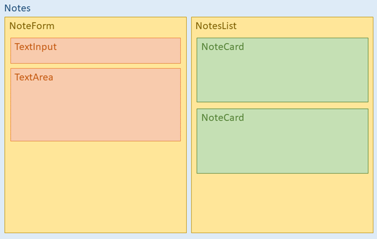
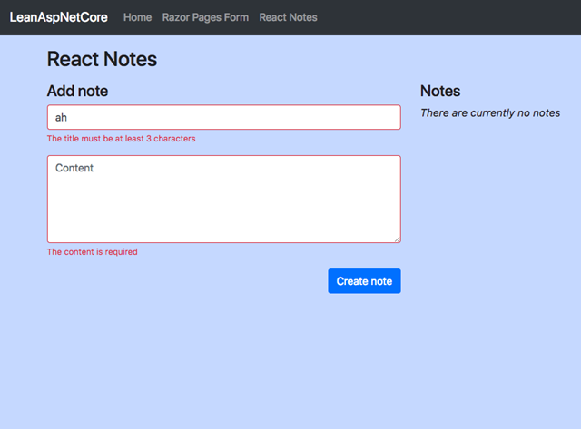

_This post is part of a multi-post series:_

1. _[Lean ASP.NET Core 2.1 – manually setup a Razor Pages project with Bootstrap, NPM and webpack](../lean-asp-net-core-2-1-manually-setup-a-razor-pages-project-with-bootstrap-npm-and-webpack/)_
2. _[Lean ASP.NET Core 2.1 – add a React application to an existing Razor Pages application](../lean-asp-net-core-2-1-add-a-react-application-to-an-existing-razor-pages-application/)_ 
3. _Lean ASP NET Core 2.1 – React forms, validation and Web API integration (this post)_

### The Notes application

In [the previous post](../lean-asp-net-core-2-1-add-a-react-application-to-an-existing-razor-pages-application/), we added a very tiny client-side [React](https://reactjs.org) app to an existing [ASP.NET Core](https://www.asp.net/core/overview/aspnet-vnext) [Razor Pages](https://docs.microsoft.com/en-us/aspnet/core/razor-pages/) application. In this post we’re extending the React app with a form and build a small back-end API. The end result is a notes-taking application that allows you to add and remove notes. It shows an efficient way how to do forms and validation with the React - ASP.NET Core stack where our main goal is to leverage the validation logic from the server so we don’t have to code that logic twice. 

You can find the source code for this post at [https://github.com/martijnboland/LeanAspNetCore-React](https://github.com/martijnboland/LeanAspNetCore-React "https://github.com/martijnboland/LeanAspNetCore-React"). The server side code is C# and the client side code is TypeScript.

### The back-end API

For our example app we only need a very simple back-end API that can list, add and remove notes. This is the Web API controller code ([/Api/Notes/NotesController.cs](https://github.com/martijnboland/LeanAspNetCore-React/blob/master/Api/Notes/NotesController.cs)):

```csharp
[Route("api/notes")]
public class NotesController : Controller
{
    private NotesStore _notesStore;

    public NotesController(NotesStore notesStore)
    {
         _notesStore = notesStore;
    }

    [HttpGet]
    public IActionResult Get()
    {
        var notes = _notesStore.GetAll().OrderByDescending(n => n.CreatedAt);
        return Ok(notes);
    }
    
    [HttpPost]
    public IActionResult Add([FromBody]Note note)
    {
        if (ModelState.IsValid)
        {
            note = _notesStore.AddNote(note);
            return Created($"api/notes/{note.Id}", note);
        }
        return BadRequest(ModelState);
    }

    [HttpDelete("{noteId}")]
    public IActionResult Remove(string noteId)
    {
        _notesStore.RemoveNote(noteId);
        return NoContent();
    }
}
```

Nothing fancy here, just a standard ASP.NET Web API controller. The Add method performs validation via data annotations on the Note class ([/Api/Notes/Note.cs](https://github.com/martijnboland/LeanAspNetCore-React/blob/master/Api/Notes/Note.cs)):

```csharp
public class Note
{
    public string Id { get; set; }
    
    [Required(ErrorMessage = "The title is required")]
    [MinLength(3, ErrorMessage = "The title must be at least 3 characters")]
    [MaxLength(100, ErrorMessage = "The title may not exceed 100 characters")]
    public string Title { get; set; }
    
    [Required(ErrorMessage = "The content is required")]
    [MaxLength(1000, ErrorMessage = "The content may not exceed 1000 characters")]
    public string Content { get; set; }

    public DateTime CreatedAt { get; set; }
}
```

When a validation error occurs, the Add method returns a BadRequest ActionResult with the invalid ModelState as data. This is a common pattern in many ASP.NET web API applications.

### The React front-end

We’re creating a React app that lists notes on the right side of the screen and has a form to create new notes on the left side. The image  below shows how the app is composed from individual React components:



In a typical react-way, this app has ‘smart’ and ‘dumb’ components. The top-level Notes component is the smart component that connects the User Interface with the API. The other components are Stateless Functional Components that receive data via their props and delegate event handling to their parent(s).

In this post, we’ll focus on the left side of the app, the form.

### React and forms

To be honest, forms and React can be quite cumbersome together. If you follow the [form guidelines in the official documentation](https://reactjs.org/docs/forms.html), you’ll end up with a massive amount of boilerplate code, just to transfer values from and to the input elements. Luckily, as with everything React, there are at least two libraries that take away most of the boilerplate code. [Formik](https://github.com/jaredpalmer/formik) is one popular library but we’re using [React-Final-Form](https://github.com/final-form/react-final-form) which is equally powerful. These libraries handle setting and getting input values, but also have hooks for validation, dirty checking and much more.

So, how does it look, a TypeScript React form with React-Final-Form components ([/ClientApp/js/react-notes/NoteForm.tsx](https://github.com/martijnboland/LeanAspNetCore-React/blob/master/ClientApp/js/react-notes/NoteForm.tsx))?

```jsx
import * as React from 'react';
import { Form, Field } from 'react-final-form';
import { TextInput } from '../components/TextInput';
import { TextArea } from '../components/TextArea';
import { Note } from './models';

interface NoteFormProps {
  handleSave: (note: Note) => Promise<any>
}

const NoteForm: React.SFC<NoteFormProps> = (props) => {
  
  return (
    <Form
      onSubmit={props.handleSave}
      render={({ handleSubmit, pristine, submitting, submitError, form }) => {
        
        return (
          <form onSubmit={(e) => handleSubmit(e).then(res => { 
            if (!res) {
              form.reset();
            }
           })}>
            {submitError && <div className="alert alert-danger">{submitError}</div>}
            <Field name="title" component={TextInput} placeholder="Title" />
            <Field name="content" component={TextArea} placeholder="Content" rows="5" />
            <div className="float-right">
              <button type="submit" className="btn btn-primary" disabled={submitting || pristine}>Create note</button>
            </div>
          </form>
        )
      }}/>
  );
};

export default NoteForm;
```

The Form and Field components come from the React-Final-Form library and are basically wrappers around your own components or standard JSX elements. Form has a [render prop](https://reactjs.org/docs/render-props.html) that provides all sorts of functionality for working with forms. The Field component has a ‘component’ attribute where we use our own TextInput and TextArea components. These are standard input and textarea elements wrapped in some Bootstrap layout elements ([/ClientApp/js/components/TextInput.tsx](https://github.com/martijnboland/LeanAspNetCore-React/blob/master/ClientApp/js/components/TextInput.tsx)):

```jsx
import * as React from 'react';
import * as classNames from 'classnames';

export const TextInput: React.SFC<any> = ({ input, meta, label, type, ...rest }) => {

  const inputType = type || 'text';

  return (
    <div className="form-group">
      {label &&
        <label htmlFor={input.name}>{label}</label>
      }    
      <input {...input} {...rest} type={inputType} className={classNames('form-control', { 'is-invalid': (meta.error || meta.submitError) })} />
      {(meta.error || meta.submitError) && meta.touched && <div className="invalid-feedback">{meta.error || meta.submitError}</div>}
    </div>
  );
}
```

When being used as component in a Field component, our own components (like TextInput above) get extra form-related props (input, meta) for free.

After submitting the form, the onSubmit() method of the Form component is called with an object that contains the form values. In our case, this corresponds with an object of the [Note](https://github.com/martijnboland/LeanAspNetCore-React/blob/master/ClientApp/js/react-notes/models.ts) type. The onSubmit() method delegates the method call to the handleSave() method in the props object.

What’s interesting for us is that the handleSave() method returns a Promise. When that Promise resolves with an object, React-Final-Form assumes that it’s an error object with the field names as property names and the property values are the error messages. These are then available via the meta.submitError properties in the field components (as shown in the TextInput example code above). See also this [CodeSandbox example](https://codesandbox.io/s/9y9om95lyp) to see how React-Final-Form can handle submission errors.

### Handling validation errors

So, we now have an API that returns an object with errors when validation fails _and_ we have a form that can display errors when form submission has finished. The only thing we need to do is to glue these two together. Let’s have a look at the error response from our API:

```json
{
  "title": [
    "The title must be at least 3 characters"
  ],
  "content":[
    "The content is required"
  ]
}

```

Almost perfect. In case of an error, the API returns a JSON object with the form field names as property names and an array of error messages per property. The only issue is that the form expects a single error message per field. Therefore, we need to convert the JSON object from the API to:

```json
{
  "title": "The title must be at least 3 characters",
  "content": "The content is required"
}
```

### Calling the API and returning validation errors

Our logic that handles adding a new note resides in the top-level [Notes component](https://github.com/martijnboland/LeanAspNetCore-React/blob/master/ClientApp/js/react-notes/Notes.tsx). The createNote() function calls the api function addNote() and checks the result. If the result is ok, the list of notes is refreshed, otherwise the errors property of the result is returned as the result of the Promise:

```ts
createNote = (note: Note): Promise<any> => {
  return addNote(note)
    .then(res => {
      if (res.ok) {
        this.loadNotes();
      } else {
        return res.errors;
      }
    });
}
```

The actual calling of the API takes place in the addNote function ([/ClientApp/js/react-notes/api.ts](https://github.com/martijnboland/LeanAspNetCore-React/blob/master/ClientApp/js/react-notes/api.ts)) with the [Axios](https://github.com/axios/axios) http library:

```ts
import axios from 'axios';
import { handleApiSuccess, handleApiError, IApiResult } from '../shared/api';
import { Note } from './models';

const notesApiUrl = '/api/notes';

...

export const addNote = (note: Note): Promise<IApiResult> => {
  return axios.post(notesApiUrl, note)
    .then(handleApiSuccess)
    .catch(handleApiError);
}

...

```

In short, Axios makes a POST request with the note object as data to the ‘/api/notes’ url to create a new note. The result is then handled in a generic way with the handleApiSuccess and handeApiError callback functions (located in [/ClientApp/js/shared/api.ts](https://github.com/martijnboland/LeanAspNetCore-React/blob/master/ClientApp/js/shared/api.ts)). This is where the eventual transformation from the .NET Web API error object to the error object takes place:

```ts
import { AxiosResponse, AxiosError } from 'axios';
import { FORM_ERROR } from 'final-form';

export interface IApiResult {
  ok: boolean,
  message?: string,
  errors?: any,
  data?: any
}

export const handleApiSuccess = (response: AxiosResponse): IApiResult => {
  return {
    ok: true,
    data: response.data
  }
}

export const handleApiError = (err: AxiosError): IApiResult => {
  // when error code is 400 and response body contains properties, return object with errors, else log and rethrow
  if (err.response && err.response.status === 400 && err.response.data) {
    console.log('API returned 400 error with data, returning data for error display');
    const data = err.response.data;
    const result: IApiResult = {
      ok: false,
      errors: {}
    };
    // Convert errors array to string for the result
    if (typeof data != 'string') {
      for (let prop in data) {
        if (data.hasOwnProperty(prop)) {
          if (prop === '') {
            result.errors[FORM_ERROR] = data[prop].toString();
          } else {
            result.errors[prop] = data[prop].toString();
          }
        }
      }
    } else {
      result.message = String(data);
    }
    return result;
  } else {
    console.log(err);
    throw err;
  }
};
```

Note that there is a special case when the property name of an error is an empty string. In server-side scenario’s, these errors are usually displayed as a generic form-global errors. Here, it goes into a special FORM\_ERROR property of the errors object. This way, React Final Form treats it as a form-global error and we can access it via the submitError render prop of the Form component.

### So what did we actually create with this example?



Two things:

1. an efficient way to do forms in React in combination with ASP.NET Core Web API;
2. a way to do validation in a single place on the server that integrates nicely with the React user-interface.

Check out the code at [https://github.com/martijnboland/LeanAspNetCore-React/](https://github.com/martijnboland/LeanAspNetCore-React/ "https://github.com/martijnboland/LeanAspNetCore-React/") and play with it if you like. This is probably one of those posts where the actual code says more than the post itself :-).

Just leave a comment if things are not clear or when you have any remarks.
