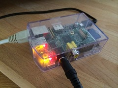
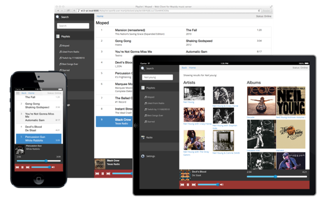

 with the goal to make it a music server for our living room that can be operated from a phone, tablet or PC.

There are several audio software solutions for the PI and one of these, [Mopidy](http://mopidy.com), promised to do exactly what I wanted. It’s a server that plays audio and it can be configured with a lot of [backend](http://docs.mopidy.com/en/latest/ext/) and [frontend](http://docs.mopidy.com/en/latest/clients/) options. Currently I use it to play Spotify music and radio streams.

The only issue I had was that none of the available HTTP clients worked exactly the way I’d like. A quick peek in the source code of one of the clients revealed that it wasn’t really complex at all, so why not build a new client?

This proved to be an ideal situation to experiment with client side JavaScript frameworks. Mopidy comes with a nice Web Sockets interface and a JavaScript library that handles all communication, so I could purely focus on the client itself.

For a first version, I picked the [Durandal](http://durandaljs.com/) framework because it appears to have quite some traction amongst .NET developers and I was just curious to see if it fits my development style. Also, [Bootstrap 3](http://getbootstrap.com/) is being used because it has excellent support for responsive web apps.

A few weeks later and the first version is now on [GitHub](https://github.com/martijnboland/moped). I’ve planned to also build an [Angular](http://angularjs.org/) version because that’s my other weapon of choice nowadays and I think it makes up for a nice comparison.

