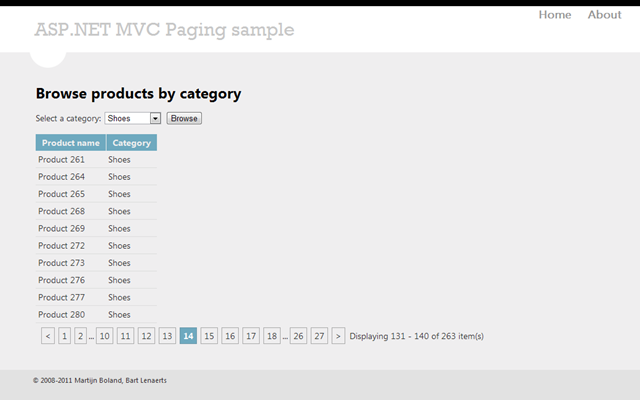

A new version of the [MvcPaging](https://github.com/martijnboland/mvcpaging) component is available via [NuGet](https://nuget.org/packages/MvcPaging) with the following changes:

- Added ItemStart and ItemEnd properties to IPagedList (Displaying items {ItemStart} - {ItemEnd}).
- Non-canonical url's for page 1 ([https://github.com/martijnboland/MvcPaging/issues/2](https://github.com/martijnboland/MvcPaging/issues/2)).

So the core library hasn’t changed much, and in all honesty, I think it’s pretty much done. Please leave a reply if you think otherwise.

What did change substantially is the sample application. It was still very much ASP.NET 1.0 with WebForms views. This is now a proper ASP.NET MVC 3 application with Razor views and the default ASP.NET MVC 4.0 template for look & feel.

 

The sample application can be found at [GitHub](https://github.com/martijnboland/mvcpaging).
