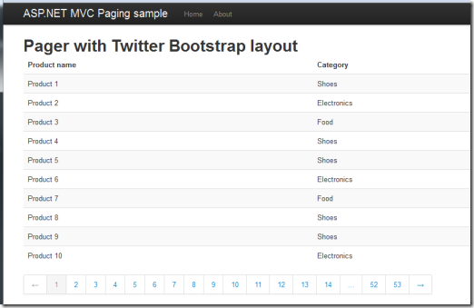

Last week, a new version of the [MvcPaging](http://github.com/martijnboland/mvcpaging) library has [been released](http://nuget.org/packages/MvcPaging). This time there are some breaking changes and that’s why the major version number is increased.

What’s new:

- Simplified API with reduced number of Html.Pager overloads;
- DisplayTemplate option and PaginationModel;
- Configurable number of pages.

### Simplified API

There have been some requests for extra configuration options, but I didn’t want to add more overloads to the Html.Pager helper. Instead, the number of overloads is reduced drastically:

```
Html.Pager(int pageSize, int currentPage, int totalItemCount)
```

and

```
Html.Pager(int pageSize, int currentPage, int totalItemCount, AjaxOptions ajaxOptions)
```

We now only have a method with the _required_ parameters and one overload for Ajax scenarios. Also, the Ajax.Pager helper is removed. Note that this is a breaking change, so if you were using the Ajax.Pager helper, you now have to use the Html.Pager with the AjaxOptions overload.

Non-required configuration options are added via the Options() method. This interface also replaces the overloads in the previous version where you could set route values or controller actions. This is the second breaking change. You can now only set these values via the Options method.

```
Html.Pager(pageSize, pageNumber, totalItemCount).Options(o => o
    .Action("action")
    .AddRouteValue("q", mySearchQuery)
)
```

Below are all options:

- **Action**(string action)Sets an alternative action for the pager that is different from the current action.
- **AddRouteValue**(string name, object value)Adds a single route value parameter that is added to page url's.
- **RouteValues**(object routeValues)Adds route value parameters that are added to the page url's.
- **RouteValues**(RouteValueDictionary routeValues)Adds route value parameters that are added to the page url's.
- **DisplayTemplate**(string displayTemplate)When set, the internal HTML rendering is bypassed and a DisplayTemplate view with the given name is rendered instead. Note that the DisplayTemplate must have a model of type PaginationModel.
- **MaxNrOfPages**(int maxNrOfPages)Sets the maximum number of pages to show.

### DisplayTemplate option

A few people have been asking for configurable rendering, especially since [Twitter Bootstrap](http://twitter.github.com/bootstrap/) has become popular. [Rajeesh CV](https://github.com/cvrajeesh) submitted a pull request that introduced a view model for the Pager, the PaginationModel. This view model made it very easy to create an option where you can specify a DisplayTemplate that is used for the actual rendering. It works like any other ASP.NET MVC DisplayTemplate and requires a model of PaginationModel. As a bonus, the PaginationModel makes unit testing a lot easier.

The [MvcPaging.Demo](https://github.com/martijnboland/MvcPaging/tree/master/src/MvcPaging.Demo) project has an example [DisplayTemplate](https://github.com/martijnboland/MvcPaging/tree/master/src/MvcPaging.Demo/Views/Shared/DisplayTemplates) that renders Html that is compatible with Twitter Bootstrap:

```
Html.Pager(pageSize, pageNumber, totalItemCount).Options(o => o
    .DisplayTemplate("BootstrapPagination")
    .MaxNrOfPages(14))
```



### Configurable number of pages

As you can see in  the screenshot above, the pager can now be configured to show more or less than 10 pages via the MaxNrOfPages() option.

I’d like to thank [Rajeesh CV](https://github.com/cvrajeesh), [jbucht01](https://github.com/jbucht01) for the contributions and ideas. For more information, visit the [GitHub project page](http://github.com/martijnboland/mvcpaging), or install the Pager in your own projects with [NuGet](http://nuget.org/packages/MvcPaging).
