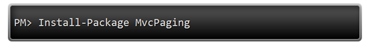
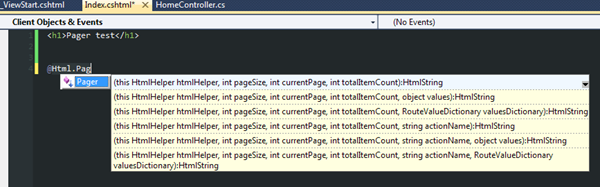
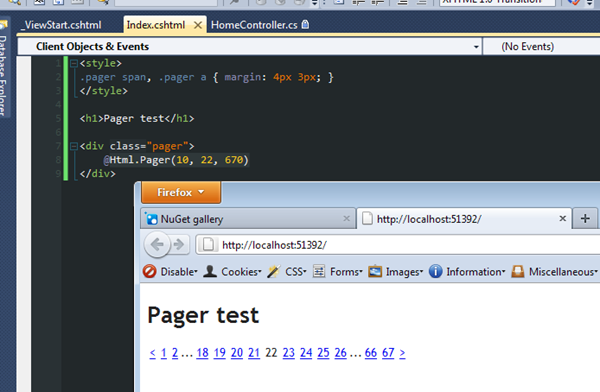
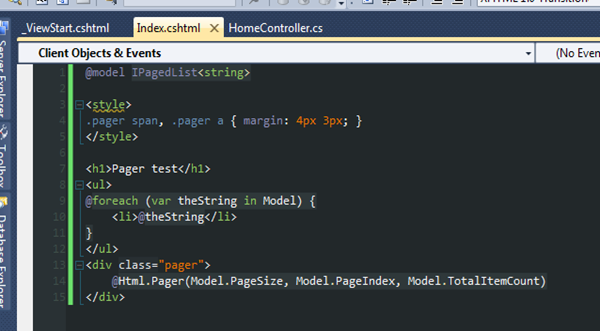

It’s now possible to add the [MVC pager](https://github.com/martijnboland/MvcPaging) to your own project with [NuGet](http://nuget.org/).

Or from Visual Studio with ‘Manage NuGet Packages...’ and then search for ‘MvcPaging’.

After installing, you can immediately use the Pager HtmlHelper in your views:

et voilà!

We also have include the IPagedList for your convenience:

For more info, check out [the original blogpost](https://blogs.taiga.nl/martijn/2008/08/27/paging-with-aspnet-mvc/) that started it or the [github project page](https://github.com/martijnboland/MvcPaging).

Enjoy!
