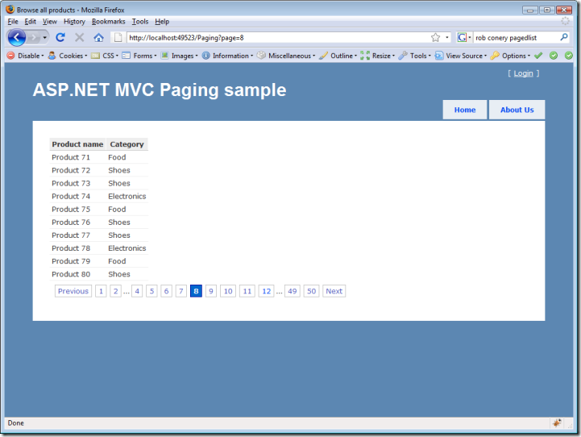
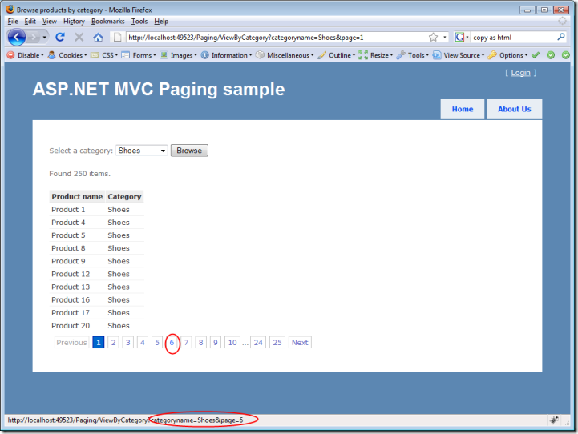

_Updated 2012-04-23: Version 2.0: [https://blogs.taiga.nl/martijn/2012/04/23/mvcpaging-2-0/](../mvcpaging-2-0/)_

_Updated 2011-05-12: Added NuGet package: [https://blogs.taiga.nl/martijn/2011/05/12/nuget-package-for-mvc-pager/](../nuget-package-for-mvc-pager/ "NuGet package for MVC pager")_

_Updated 2011-03-22: Changed download link: [https://github.com/martijnboland/MvcPaging](https://github.com/martijnboland/MvcPaging). See also [https://blogs.taiga.nl/martijn/2011/03/23/mvc-pager-update-now-with-ajax-support/](../mvc-pager-update-now-with-ajax-support/ "https://blogs.taiga.nl/martijn/2011/03/23/mvc-pager-update-now-with-ajax-support/")_

_Updated 2009-02-04: Upgraded source and demo to ASP.NET MVC RC1_

_Updated 2009-01-16: Upgraded source and demo to ASP.NET MVC Beta  
_

_Updated 2008-09-09: Source and Demo now use ASP.NET MVC preview 5_

On my latest gig, we used [ASP.NET MVC](http://asp.net/mvc) and it was a very pleasant experience! Very clean code, clean html output and the productivity was great (which is not very common when using a technology for the first time).

Of course, since ASP.NET MVC isn't finished yet, it leaves something to desire. At one time we needed paging and there isn't an out-of-the-box solution for it (yet). Some googling revealed that others had already addressed this, but to be honest, I wasn't entirely pleased with the solutions, so I grabbed the best parts and build a generic solution out of it.

[I'm in a hurry, take me to the download immediately](#download)

### IPagedList<T>

First, there was the PagedList<T> that Scott Guthrie already used in one of the earliest MVC demo's and that later appeared in improved incarnations from [Rob Conery](http://blog.wekeroad.com/2007/12/10/aspnet-mvc-pagedlistt/) and  [Troy Goode](http://www.squaredroot.com/post/2008/07/08/PagedList-Strikes-Back.aspx). This was a nice starting point, especially because we also used LINQ To SQL as our data access layer. To provide an extra extension point, I created an IPagedList<T> interface instead of using the PagedList<T> directly.

```
public interface IPagedList<T> : IList<T>
{
    int PageCount { get; }
    int TotalItemCount { get; }
    int PageIndex { get; }
    int PageNumber { get; }
    int PageSize { get; }
    bool HasPreviousPage { get; }
    bool HasNextPage { get; }
    bool IsFirstPage { get; }
    bool IsLastPage { get; }
}
```

### Html.Pager()

After choosing the IPagedList<T> implementation I started thinking about how I could create an HtmlHelper extension method that renders the page links. First, I made the mistake to couple the helper to the IPagedList<T> and it took me a little while to realize that a paging HTML helper doesn't need anything to know about the underlying data source. It's sole purpose is to generate a list of hyperlinks for pages and the only thing we need to know is the total amount of items, the page size and the current page. This is what the most basic HtmlHelper extension looks like:

```
public static string Pager(this HtmlHelper htmlHelper, int pageSize, int currentPage, int totalItemCount)
```

  
We're assuming that the page links point to the the current controller and current action. Alternatively, it's possible to supply a different action:

  

```
public static string Pager(this HtmlHelper htmlHelper, int pageSize, int currentPage, int totalItemCount, string actionName)
```

  
Combining the Pager html helper and IPagedList<T> in a view page (that inherits from ViewPage<IPagedList<Product>>):

  

```
<table class="grid">
    <thead>
        <tr>
            <th>Product name</th>
            <th>Category</th>
        </tr>
    </thead>
    <tbody>
        <% foreach (var product in Model) { %>
            <tr>
                <td><%= product.Name %></td>
                <td><%= product.Category %></td>
            </tr>
        <% } %>
    </tbody>
</table>
<div class="pager">
    <%= Html.Pager(Model.PageSize, Model.PageNumber, Model.TotalItemCount) %>
</div>
```

results in this:



You probably recognize the digg-style appearance of the pager. Thanks to the ASP.NET MVC sample application [KIGG](http://www.codeplex.com/Kigg) for inspiration :).

Internally, the pager uses RouteTable.Routes.GetVirtualPath() to render the url's so the page url's can be configured via routing to create nice looking url's like for example '/Categories/Shoes/Page/1' instead of '/Paging/ViewByCategory?name=Shoes&page=1'.

### Advanced scenarios

Many scenarios where you want to use paging also use filtering. It's possible to pass extra parameters to the Pager helper via a RouteValueDictionary or an anonymous type. This adds these parameters to the page links that are generated:

```
<div class="pager">
    <%= Html.Pager(ViewData.Model.PageSize, ViewData.Model.PageNumber, ViewData.Model.TotalItemCount, new { categoryname = ViewData["CategoryDisplayName"] } )%>
</div>
```



That's it. A complete solution with demo project can be downloaded below. Feel free to leave any comments or remarks. One of the things I'm not happy about is that I failed to properly unit test the pager, but that's for a different post.

### Download

[Download the paging sample solution, incl. the demo MVC web project](https://github.com/martijnboland/MvcPaging)

Check also the AJAX version of the pager written by Daniel Iglesias: [http://danieliglesiaseng.blogspot.com/2010/01/ajax-paging-with-aspnet-mvc.html](http://danieliglesiaseng.blogspot.com/2010/01/ajax-paging-with-aspnet-mvc.html "http://danieliglesiaseng.blogspot.com/2010/01/ajax-paging-with-aspnet-mvc.html").
