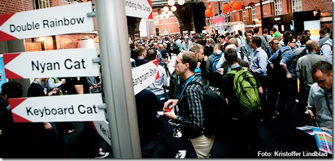

  

Last week, my partner in crime Erwin and I went to Malmö, Sweden to visit the yearly [Øredev](http://oredev.org) conference. One word: magnificent!  
Øredev is not your average developer conference where you learn about new technology. The topics are much broader, ranging from hardcore programming languages to the more social-cultural aspects of software development.

This year’s theme was ‘Vive la rebellion’ and especially the keynote sessions very much resembled this. The main message I personally got from the conference was:

> If you want to make a difference and be successful, you have to stop following what your neighbours are doing but start with your own vision, knowledge and values and **think**! Don’t do anything ‘just because’.

It’s too easy to lean back into your comfortable IDE and just put out some code because your customer wants you to. We as software developers can do some much better!

## Random tech observations

- Microsoft has fully embraced Open Source. What started with embedding jQuery in ASP.NET now expanded to a huge amount of projects and initiatives with many of these located at GitHub;
- Cloud technology is no hype anymore. It’s really happening on a large scale: Azure, Amazon, GitHub and others;
- The same goes for NoSQL databases. These are now established technologies and will not go away anymore;
- There was more Javascript than C# in the .NET sessions;
- Javascript is bringing isolated developer cultures together;
- Web, mobile, and desktop applications are converging.

## Conference

Finally, many thanks to the Øredev organization for creating such a great event. I really don’t know of any other event like this in northern/middle Europe. Highly recommended!

