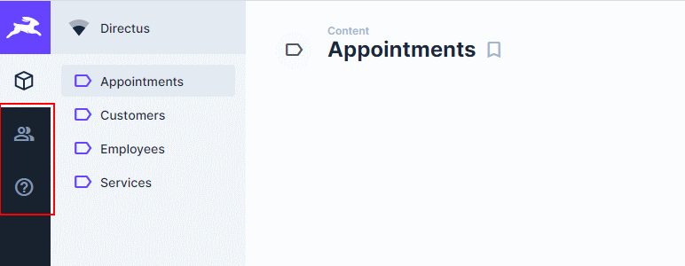
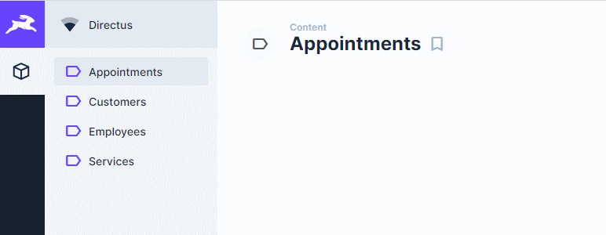

In older versions of [Directus](http://directus.io), it was possible to customize the module bar per role. We used this to hide all modules for non-admin users and only show our custom dashboard module.

Unfortunately, this feature was dropped due to a refactoring towards the ability to have more than one role per user (as I recall correctly). So we could not hide modules anymore for non-admin users.



In the above screenshot, on the left, you can see the users and docs modules. It would be great if we could hide these for specific roles.

Enter [custom api hooks](https://docs.directus.io/extensions/hooks).

In Directus, it’s possible to alter the results of a query with a read hook. An undocumented feature is that this also works for reading system items such as settings.

The following api hook simply sets the items for the module\_bar to only include the ‘content’ module:

```
[sourcecode language='javascript'  padlinenumbers='true']
module.exports = function registerHook({ filter }) {

  filter('settings.read', async (items, meta, context) => {
    if (context.accountability && ! context.accountability.admin) {
      // Only display the content module for non-admin roles
      var settings = items[0];
      settings.module_bar = [{"type":"module","id":"content","enabled":true}];
    }
    return items;
  });

};
[/sourcecode]

```

Et voilà!



You could take this much further if you want, by checking for specific roles, or filtering the existing module\_bar items.
