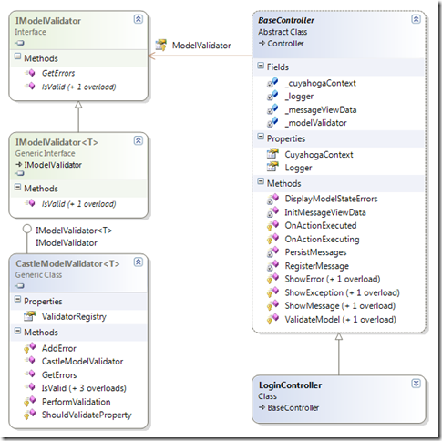
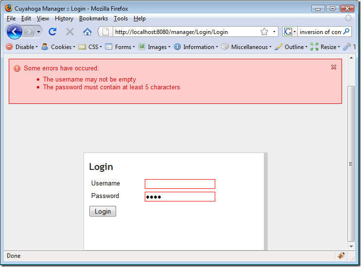

Almost every single application has to deal with validating user input. With web applications, you can choose to do the validation on the client side or on the server side. In my opinion, validation should at least take place on the server side and optionally on the client side to improve the user experience. Therefore, I'm starting this series of posts with the basic needs: server-side validation. For some background, also check the excellent [post about validation by Steve Sanderson](http://blog.codeville.net/2008/09/08/thoughts-on-validation-in-aspnet-mvc-applications/).

### Validate the model and not the UI

In the past I used the ASP.NET WebForms validators. These do a proper job, but are also very much tied to the individual pages, so you have the validation logic scattered all over the place. For Cuyahoga 2, I really wanted a better solution where validation logic is centralized in the model (and removed from the UI layer). There are already several solutions that make this possible. Microsoft PnP released the [validation application block](http://msdn.microsoft.com/en-us/library/cc309320.aspx) and recently (.NET 3.5 SP1), we have the DataAnnotations from ASP.NET Dynamic Data.

In Cuyahoga, we're using the [Castle Validator component](http://hammett.castleproject.org/?p=114) to perform basic validation, mostly because we're already using other components from the Castle stack and it just works fine. With Castle validators, you're decorating properties of your Domain entities with attributes like:

```
[ValidateNonEmpty("UserNameValidatorNonEmpty")]
```

```
[ValidateLength(1, 50, "UserNameValidatorLength")]
```

```
public virtual string UserName
```

```
{
```

```
    get { return this._userName; }
```

```
    set { this._userName = value; }
```

```
}
```

Note that it's also possible to decorate DTO's or presentation models or whatever you want to call these data containers. In Cuyahoga for example, we have a LoginViewData class that is only used in the UI layer, that is also decorated with validator attributes. If we have a validation infrastructure we might as well (ab)use it :).

### IModelValidator

So how are we going to use the Castle validators with ASP.NET MVC?

First we have to make a decision where we want to validate the model. You can do this in the controller or in the service layer (if you one). Some people suggest doing validation in the data access layer but I think the responsibility of a data access layer is persisting and retrieving the model and nothing else.

I've chosen to validate the model from the controller because it's a little bit more convenient as you don't have to throw exceptions across layers and translate those exceptions to error messages for the user. For validation, all controllers inherit from a base controller that has a **ValidateModel()** method. This controller also has an instance of an **IModelValidator** interface to perform the actual validation, so we don't pollute the controller too much with validation logic and also prevent coupling to a specific implementation.



At this point, the controller can validate, but to use the Castle validators we have to implement IModelValidator and pass that to the controller. But first: a base controller doesn't know which type to validate, but a concrete controller does (assuming we're only validating one concrete type in a controller) and therefore we created the IModelValidator<T> interface. The CastleModelValidator<T> class implements this interface.

Because we're using the [Castle Windsor IoC container](http://www.castleproject.org/container/index.html) we can wire everything together in the controller constructor:

```
public class LoginController : BaseController
```

```
{
```

```
    private readonly IAuthenticationService _authenticationService;
```

```
    /// <summary>
```

```
    /// Create and initialize an instance of the LoginController class.
```

```
    /// </summary>
```

```
    /// <param name="authenticationService">The authentication service</param>
```

```
    /// <param name="modelValidator">The IModelValidator for LoginViewData</param>
```

```
    public LoginController(IAuthenticationService authenticationService, IModelValidator<LoginViewData> modelValidator)
```

```
    {
```

```
        this._authenticationService = authenticationService;
```

```
        this.ModelValidator = modelValidator;
```

```
    }
```

```
}
```

In the container is the registered that when asked for an instance of IModelValidator<T>, the container should return an instance of CastleModelValidator<T>. The constructor in the code above, receives an instance of CastleModelValidator<LoginViewData>and sets the ModelValidator of the base controller.

### How it works: the login screen

The Login action of the LoginController performs validation after populating a LoginViewData instance via TryUpdateModel():

```
public ActionResult Login(string returnUrl)
```

```
{
```

```
    var loginUser = new LoginViewData();
```

```
    try
```

```
    {
```

```
        if (TryUpdateModel(loginUser) && ValidateModel(loginUser))
```

```
        {
```

```
             // do authentication and exception handling
```

ValidateModel() automatically adds all errors to the ASP.NET MVC ModelState, so we have to do very little to actually display the validation errors:

[](https://blogs.taiga.nl/martijn/wp-content/uploads/subtext/WindowsLiveWriter/Val.NETMVCpart1basicserversidevalidation_F58F/login_2.png)

### The code

This is a series of posts that is directly inspired by Cuyahoga development. All code can be found in the Cuyahoga SVN trunk at [https://cuyahoga.svn.sourceforge.net/svnroot/cuyahoga/trunk](https://cuyahoga.svn.sourceforge.net/svnroot/cuyahoga/trunk "https://cuyahoga.svn.sourceforge.net/svnroot/cuyahoga/trunk"). Please note that all ASP.NET MVC stuff sits in the Manager subdirectory of the Cuyahoga.Web: [https://cuyahoga.svn.sourceforge.net/svnroot/cuyahoga/trunk/Web/Manager](https://cuyahoga.svn.sourceforge.net/svnroot/cuyahoga/trunk/Web/Manager "https://cuyahoga.svn.sourceforge.net/svnroot/cuyahoga/trunk/Web/Manager").
