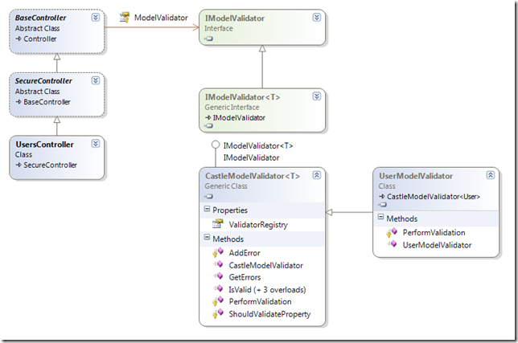
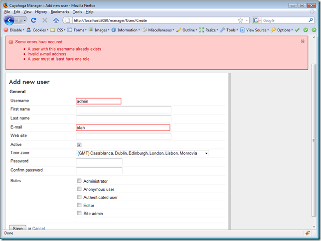

This is a post in a series of posts. See also:

- [Validation in ASP.NET MVC - part 1: basic server-side validation](../validation-in-asp.net-mvc-part-1-basic-server-side-validation)

In the first post of this series, I showed how you can perform basic server-side validation on your model with help of the [Castle Validator component](http://hammett.castleproject.org/?p=114). To summarize this post: the controller validates an object that is decorated with validation attributes with the help of an IModelValidator component and adds errors to the ModelState.

The first reason to abstract the validator was to prevent coupling of MVC controllers to the Castle Validators. But the abstraction also provides a very nice extension point. We can inject any kind of validator into the controller constructor as long as it implements the IModelValidator interface:

```
public LoginController(IAuthenticationService authenticationService, IModelValidator<LoginViewData> modelValidator)
```

```
{
```

```
    this._authenticationService = authenticationService;
```

```
    this.ModelValidator = modelValidator;
```

```
}
```

In the example above, the constructor requires an IModelValidator<LoginViewData> instance. In our case, [Castle Windsor](http://www.castleproject.org/container/index.html) injects a CastleModelValidator<LoginViewData> instance that is registered in the container for IModelValidator<T>. We're already seeing the first extension: the IModelValidator interface has a generic inheritor.

### Extending the ModelValidator

In many scenario's, property validation with the generic CastleModelValidator<T> will suffice, but sometimes you'll need some extra validation. For example, when creating a new user, we want to check if the username doesn't already exist. To perform this check, we created a UserModelValidator class that inherits CastleModelValidator<T>.



The CastleModelValidator<T> calls a virtual method PerformValidation() while validating via IsValid(). In UserModelValidator, this method is overriden and performs the check if the username is unique:

```
public class UserModelValidator : CastleModelValidator<User>
```

```
{
```

```
    private readonly IUserService _userService;
```

```
    public UserModelValidator(IUserService userService)
```

```
    {
```

```
        _userService = userService;
```

```
    }
```

```
    protected override void PerformValidation(User objectToValidate, ICollection<string> includeProperties)
```

```
    {
```

```
        // First validate the property values via the Castle validator.
```

```
        base.PerformValidation(objectToValidate, includeProperties);
```

```
        // Check username uniqueness.
```

```
        if (ShouldValidateProperty("UserName", includeProperties)
```

```
            && ! String.IsNullOrEmpty(objectToValidate.UserName))
```

```
        {
```

```
            if (this._userService.FindUsersByUsername(objectToValidate.UserName).Count > 0)
```

```
            {
```

```
                AddError("UserName", "UserNameValidatorNotUnique", true);
```

```
            }
```

```
        }
```

```
    }
```

```
}
```

Because the modelvalidators are registered in the Windsor Container, we can inject any kind of service or data access component into the validator and thus making it very easy to perform custom validation logic that needs to check the database, or check an external web service.

### Tying things together

We want the UsersController to use the custom UserModelValidator when ValidateModel() is called. All we have to do is to add UserModelValidator to the constructor of the controller and we're done:

```
public UsersController(IUserService userService, UserModelValidator userModelValidator)
```

```
{
```

```
    this._userService = userService;
```

```
    this.ModelValidator = userModelValidator;
```

```
}
```

Finally, this is how it looks in the browser. Nice to see the custom validation error nicely integrated with the rest of the errors.



### Other extension possibilities

In this post we've seen an example where we extended our CastleModelValidator<T> to perform custom logic by calling another service. You might as well call a method on the object itself that is validated to perform custom business logic:

```
protected override void PerformValidation(MyClass objectToValidate, ICollection<string> includeProperties)
```

```
{
```

```
    base.PerformValidation(objectToValidate, includeProperties);
```

```
    if (! objectToValidate.CheckThatMyBizarreBusinessRuleIsValid())
```

```
    {
```

```
        AddError("MyProperty", "The object to validate is invalid.");
```

```
    }
```

```
}
```

You can also opt for plugging in a completely different library. [CSLA](http://www.lhotka.net/cslanet/) fans can very easily implement their own version of IModelValidator<T>, or you could write an IModelValidator<T> implementation that uses the [Validation Application Block](http://msdn.microsoft.com/en-us/library/cc309320.aspx) from Enterprise Library.

### The code

This is a series of posts that is directly inspired by Cuyahoga development. All code can be found in the Cuyahoga SVN trunk at [https://cuyahoga.svn.sourceforge.net/svnroot/cuyahoga/trunk](https://cuyahoga.svn.sourceforge.net/svnroot/cuyahoga/trunk). The validation stuff sits in the Validation subdirectory of Cuyahoga.Core: [https://cuyahoga.svn.sourceforge.net/svnroot/cuyahoga/trunk/Core/Validation](https://cuyahoga.svn.sourceforge.net/svnroot/cuyahoga/trunk/Core/Validation). Note that Cuyahoga is work in progress. It's not guaranteed that the code in SVN will be exactly the same as the sample code in this post.
