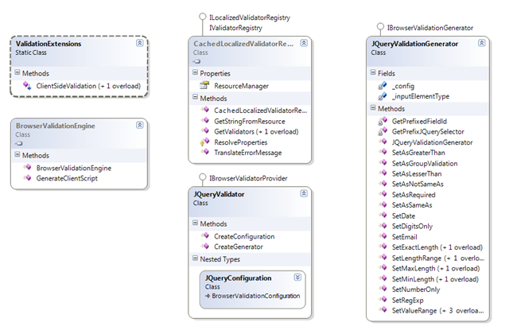
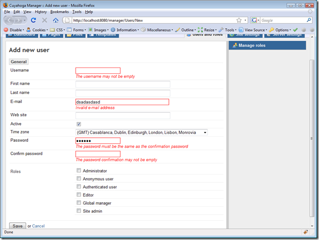

This is part 3 of a series of posts. See also:

- [Validation in ASP.NET MVC - part 1: basic server-side validation](https://blogs.taiga.nl/martijn/2008/11/26/validation-in-asp.net-mvc-part-1-basic-server-side-validation)
- [Validation in ASP.NET MVC - part 2: custom server-side validation](https://blogs.taiga.nl/martijn/2008/11/27/validation-in-asp.net-mvc-part-2-custom-server-side-validation)

In the first two parts, I showed how you can perform validation on the server side with Castle Validation attributes and extend that model with custom validation logic. With this, we have everything we need to properly validate our model.

For a better user experience though, it would also be nice that we could re-use (part of) our validation logic on the client-side. Luckily, lots of others have already looked into this and the only thing I had to do was to throw everything together and stir it a little bit :).

The ingredients are:

- [The jQuery validation plugin](http://bassistance.de/jquery-plugins/jquery-plugin-validation/) (an obvious choice, since we were already using jQuery in [Cuyahoga](http://cuyahoga-project.org));
- [Monorail client-side code generator for jQuery validation](http://svn.castleproject.org:8080/svn/castle/trunk/MonoRail/Castle.MonoRail.Framework/Helpers/ValidationStrategy) (originally contributed by Gildas, but also many credits to the Castle Monorail guys for creating such a flexible infrastructure);
- [Model-based Client-side Validation for ASP.NET MVC](http://blog.codeville.net/2008/04/30/model-based-client-side-validation-for-aspnet-mvc/) (very inspiring blog post by Steve Sanderson).

### How it works

### 

1. The client-side validation is called via an HtmlHelper extension method ClientSideValidation: <%= Html.ClientSideValidation(ViewData.Model, "my\_form\_id")%>;
2. The HtmlHelper extension requests an instance of a BrowserValidationEngine that returns the client script for validation;
3. BrowserValidationEngine has a reference to an IValidatorRegistry instance that returns all (Castle) validators for the given model;
4. For each validator, the referenced IBrowserValidatorProvider generates the appropriate client script;
5. Finally, all generated client script code is combined and sent to the browser in a single javascript block.

The existing Monorail codebase proved to be of great value and could be used almost seamlessly. The only difference is the way the client code is generated. Originally, the validators generated css class attributes for the Monorail form helpers, but we don't have those with ASP.NET MVC, so all client code is generated as jQuery validation rules.

Below, you can see the output of the validation helper for the new user form in Cuyahoga:

```
<script type="text/javascript">
```

```
$(document).ready(function() {
```

```
    jQuery.validator.addMethod('notEqualTo', function(value, element, param) { return value != jQuery(param).val(); }, 'Must not be equal to {0}.' );
```

```
    jQuery.validator.addMethod('greaterThan', function(value, element, param) { return ( IsNaN( value ) && IsNaN( jQuery(param).val() ) ) || ( value > jQuery(param).val() ); }, 'Must be greater than {0}.' );
```

```
    jQuery.validator.addMethod('lesserThan', function(value, element, param) { return ( IsNaN( value ) && IsNaN( jQuery(param).val() ) ) || ( value < jQuery(param).val() ); }, 'Must be lesser than {0}.' );
```

```
    jQuery.validator.addMethod('numberNative', function(value, element, param) { return this.optional(element) || /^-?(?:\d+|\d{1,3}(?:\.\d{3})+)(?:\,\d+)?$/.test(value); }, 'Not a valid number.' );
```

```
    jQuery.validator.addMethod('simpleDate', function(value, element, param) { return this.optional(element) || /^\d{1,2}\-\d{1,2}\-\d{4}$/.test(value); }, 'Not a valid date.' );
```

```
    $("#userform").validate({
```

```
        rules : {
```

```
            UserName: {  rangelength: [1, 50] , required: true },
```

```
            Password: {   required: true , rangelength: [5, 50] , equalTo: "#PasswordConfirmation" },
```

```
            PasswordConfirmation: {   equalTo: "#Password" , rangelength: [5, 50] , required: true },
```

```
            FirstName: { rangelength: [1, 100] },
```

```
            LastName: { rangelength: [1, 100] },
```

```
            Email: {   required: true , rangelength: [1, 100] , email: true },
```

```
            Website: { rangelength: [1, 100] }
```

```
        },
```

```
        messages : {
```

```
            UserName: {  rangelength: "The username must be between 1 and 50 characters" , required: "The username may not be empty" },
```

```
            Password: {   required: "The password may not be empty" , rangelength: "The password must contain at least 5 characters" , equalTo: "The password must be the same as the confirmation password" },
```

```
            PasswordConfirmation: {   equalTo: "The password must be the same as the confirmation password" , rangelength: "The password must contain at least 5 characters" , required: "The password confirmation may not be empty" },
```

```
            FirstName: { rangelength: "The firstname must be between 1 and 100 characters" },
```

```
            LastName: { rangelength: "The lastname must be between 1 and 100 characters" },
```

```
            Email: {   required: "E-mail address may not be empty" , rangelength: "E-mail address must be between 1 and 100 characters" , email: "Invalid e-mail address" },
```

```
            Website: { rangelength: "The website url must be between 1 and 100 characters" }
```

```
        }
```

```
    });
```

```
});
```

```
</script>
```

which results in this:



### Summarizing validation

In this series of posts, I showed how we deal with validation in Cuyahoga and ASP.NET MVC. Personally, I think the nicest part of it is that we have our validation rules centralized and we only have to add one line of code to the view to enable client-side validation.

The code can be found in [Cuyahoga SVN](https://cuyahoga.svn.sourceforge.net/svnroot/cuyahoga/trunk/) and more specifically in the [validation](https://cuyahoga.svn.sourceforge.net/svnroot/cuyahoga/trunk/Core/Validation/) [sections](https://cuyahoga.svn.sourceforge.net/svnroot/cuyahoga/trunk/Cuyahoga.Web.Mvc/Validation/) and the [ASP.NET MVC manager](https://cuyahoga.svn.sourceforge.net/svnroot/cuyahoga/trunk/Web/Manager/). I'll try to make a standalone sample project with all the validation stuff somewhere in the near future.
