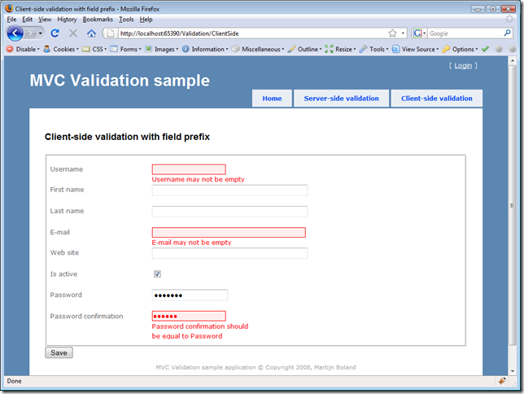

This is part 4 of a series of posts. See also:

- [Validation in ASP.NET MVC - part 1: basic server-side validation](https://blogs.taiga.nl/martijn/2008/11/26/validation-in-asp.net-mvc-part-1-basic-server-side-validation)
- [Validation in ASP.NET MVC - part 2: custom server-side validation](https://blogs.taiga.nl/martijn/2008/11/27/validation-in-asp.net-mvc-part-2-custom-server-side-validation)
- [Validation in ASP.NET MVC - part 3: client-side validation with jQuery validation](https://blogs.taiga.nl/martijn/2008/12/08/validation-in-asp.net-mvc-part-3-client-side-validation-with)

In the previous posts, I described how we implemented model-based validation on the server-side in [Cuyahoga](http://cuyahoga-project.org) with ASP.NET MVC and as the icing on the cake, we also added some client-side validation (also model-based).

Now, everything can be found in the [Cuyahoga SVN sources](https://cuyahoga.svn.sourceforge.net/svnroot/cuyahoga/trunk/) but I have to agree that it can be a daunting task to check out the complete sources and find all pieces of the validation puzzle. Therefore, I've created a little sample application with everything from the previous posts combined.

Hopefully, this will make things a little bit clearer. You can download the sample app here are required.

Enjoy!
